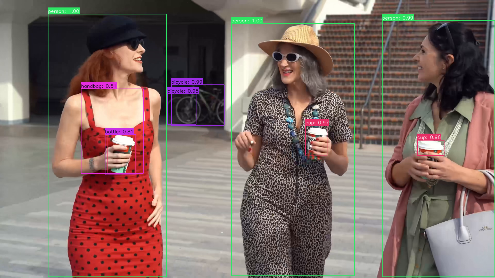

# Detr

This example runs Detr with AMLNN. The full flow is:

1. Prepare or download an ONNX model.
2. Convert the ONNX model to an ADLA model.
3. Run the Python demo with the ADLA model.
4. Run the C++ (Linux/Android) demo with the ADLA model.
5. Check detection images/results.

## Directory Layout

```bash
examples/DETR/
├── cpp/               # C++ demo and build scripts
├── input/             # Input images for demo
├── model/             # Put ONNX and ADLA models here
├── py/                # Python conversion and demo scripts
└── result.jpg         # Example detection output
```

## License

This example code is licensed under the Apache License 2.0. See the repository root [LICENSE](../../LICENSE) file for details.

The DETR model used in this example is provided by a third party and is derived from the [Facebook Research DETR project](https://github.com/facebookresearch/detr). The original DETR model is distributed under the Apache License 2.0.

The converted and quantized DETR model used by this example is distributed from our server under the Apache License 2.0. Please retain the applicable copyright, license, and attribution notices when redistributing the model.

> Copyright 2020 - present, Facebook, Inc.
>
> Licensed under the Apache License, Version 2.0 (the "License");
> you may not use this file except in compliance with the License.
> You may obtain a copy of the License at
>
> ```
> http://www.apache.org/licenses/LICENSE-2.0
> ```
>
> Unless required by applicable law or agreed to in writing, software
> distributed under the License is distributed on an "AS IS" BASIS,
> WITHOUT WARRANTIES OR CONDITIONS OF ANY KIND, either express or implied.
> See the License for the specific language governing permissions and
> limitations under the License.

The model preprocessing and postprocessing code in this example was partially generated with AI assistance and subsequently reviewed and adapted for this project. If any part is inadvertently similar to existing work and causes concern, please contact us, and we will remove or adjust it promptly.

## 1. Prepare The ONNX Model

### Download ONNX

Download the prepared ONNX model and put it under `examples/DETR/model/`:

### [Download DETR ONNX model here!](https://pub-8378326bd0fe4b1d9312a3847f6316a2.r2.dev/model_zoo/detr/detr.onnx)

Expected path:

```text
examples/DETR/model/detr.onnx
```

## 2. Convert ONNX To ADLA

Run the ADLA export script from `examples/DETR/py`:

```bash
cd examples/DETR/py
python export_adla.py \
  --onnx ../model/detr.onnx \
  --target-platform 007 \
  --output-dir ../model
```

| Parameter           | Description                                                                                     |
| ------------------- | ----------------------------------------------------------------------------------------------- |
| `--onnx`            | Path to the input `.onnx` model.                                                                |
| `--target-platform` | Target platform ID. See the full list of supported platforms [**HERE**](../../docs/mapping.md). |
| `--output-dir`      | (Optional) Directory where the generated `.adla` model will be saved. Defaults to `../model`.   |

After conversion, the generated AMLNN filename is preserved. With the current `w16a16` configuration, the expected model path is:

```text
examples/DETR/model/detr_w16a16.adla
```

## 3. Run Python Demo

### Prerequisites

* Python 3.10
* Required packages: `amlnn`

### Install Dependencies

```bash
pip install amlnn_edge_toolkit_lite-1.0.0-cp310-cp310-linux_aarch64.whl
```

### Run on Device

```bash
python detr_inference.py \
    --adla ../model/detr_w16a16.adla \
    --image-dir ../input
```

Argument Descriptions:

| Argument       | Description                                                                         |
| -------------- | ----------------------------------------------------------------------------------- |
| `--adla` | Path to the compiled DETR model in `.adla` format.                                  |
| `--image-dir`  | Directory containing test images.                                                   |
| `--conf`       | (Optional) Confidence score threshold used to filter detections. Defaults to `0.5`. |

The script will automatically process all image files (`.jpg`, `.jpeg`, `.png`, `.bmp`) in the specified image directory and save results to a `{model_name}_result` folder.

## 4. Run C++ Demo

### Build For Android

#### Prerequisites

* **Android NDK** (r27d recommended) installed on your system.
* **AMLNN Toolkit** downloaded and extracted.
* Prebuilt OpenCV for Android located in the `dependency/opencv/` folder.

#### 1. Setup Environment

Export the paths to your NDK (the toolchain) and AMLNN (the neural network dependency) so the script can find them.

```bash
export ANDROID_NDK_PATH=/path/to/android-ndk-r27d
export AMLNN_HOME=/path/to/amlnn-toolkit/amlnn_runtime
```

#### 2. Build

Navigate to the C++ directory and run the build script.

```bash
cd examples/DETR/cpp

# Build for 64-bit (arm64-v8a) - Default
./build-android.sh

# Build for 32-bit (armeabi-v7a)
./build-android.sh -a armeabi-v7a
```

The executable will be generated in the build folder corresponding to the selected Android ABI:

* 64-bit: `build/android/arm64-v8a/detr_demo`
* 32-bit: `build/android/armeabi-v7a/detr_demo`

#### 3. Example Run

The following example uses the default 64-bit (`arm64-v8a`) build.

```bash
# Push executable and assets to device
adb shell "mkdir -p /data/local/tmp/"
adb push build/android/arm64-v8a/detr_demo /data/local/tmp/
adb push ../model/detr_w16a16.adla /data/local/tmp/
adb push ../input/ /data/local/tmp/

# Run on device
adb shell
cd /data/local/tmp
chmod +x detr_demo
export LD_LIBRARY_PATH=/vendor/lib64

# Usage: ./detr_demo <model_path> <image_dir>
./detr_demo detr_w16a16.adla input/
```

> **Note:** For a 32-bit (`armeabi-v7a`) build, use `build/android/armeabi-v7a/detr_demo` and the corresponding 32-bit library path. Replace `detr_w16a16.adla` with your actual model file name.

---

### Build For Linux

The Linux build process supports two distinct modes:

1. **Standard Linux cross-compilation** (default)
2. **Yocto SDK compilation**

#### Mode 1: Standard Linux Cross-Compile (Default)

##### Prerequisites

* A GCC Cross-Compiler toolchain (GCC 10.3 recommended).
* The toolchain's `bin/` folder must be added to your system's `PATH`.
* Prebuilt OpenCV located in the `dependency/opencv/` folder.
* `AMLNN_HOME` environment variable set.

##### 1. Setup Environment

Add your downloaded toolchain to your `PATH` and export the `AMLNN_HOME` variable so the script can find the compiler and neural network dependencies.

```bash
# Export the AMLNN path
export AMLNN_HOME=/path/to/amlnn-toolkit/amlnn_runtime

# For 64-bit (aarch64) builds, add the 64-bit toolchain to PATH:
export PATH=/path/to/gcc-arm-10.3-2021.07-x86_64-aarch64-none-linux-gnu/bin:$PATH

# OR for 32-bit (arm) builds, add the 32-bit toolchain to PATH:
export PATH=/path/to/gcc-arm-10.3-2021.07-x86_64-arm-none-linux-gnueabihf/bin:$PATH
```

##### 2. Build

```bash
cd examples/DETR/cpp

# Build for 64-bit (Default)
./build-linux.sh

# Build for 32-bit
./build-linux.sh -b 32
```

> **Optional Override:** If your compiler has a different prefix name (for example, `aarch64-linux-gnu` instead of `aarch64-none-linux-gnu`), you can override the default by setting the `GCC_COMPILER` variable:

```bash
GCC_COMPILER=aarch64-linux-gnu ./build-linux.sh
```

The executable will be generated in the build folder corresponding to the selected architecture:

* 64-bit: `build/linux/64/detr_demo`
* 32-bit: `build/linux/32/detr_demo`

#### Mode 2: Yocto/Debian/Armbian Build

##### 1. Prerequisites

* Yocto SDK installed.
* CMake Toolchain file available.
* Prebuilt OpenCV located at `../../../dependency/opencv/` (relative to the script directory).

##### 2. Setup Environment

```bash
# Export the AMLNN path
export AMLNN_HOME=/path/to/amlnn-toolkit/amlnn_runtime
```

##### 3. Build

```bash
cd examples/DETR/cpp

# Build for Yocto 64-bit (Default)
./build-linux.sh -m yocto -s /path/to/yocto_sdk_root -t /path/to/toolchain.cmake

# Build for Yocto 32-bit
./build-linux.sh -m yocto -b 32 -s /path/to/yocto_sdk_root -t /path/to/toolchain.cmake
```

> **Note:** You can also use the `YOCTO_SDK_ROOT` and `TOOLCHAIN_FILE` environment variables instead of passing the `-s` and `-t` flags.

The executable will be generated in the build folder corresponding to the selected architecture:

* 64-bit: `build/yocto/64/detr_demo`
* 32-bit: `build/yocto/32/detr_demo`

#### 3. Example Run

The following example uses the default 64-bit Linux build.

```bash
# Push executable and assets to device (adjust build path if using Yocto)
adb shell "mkdir -p /data/local/tmp/"
adb push build/linux/64/detr_demo /data/local/tmp/
adb push ../model/detr_w16a16.adla /data/local/tmp/
adb push ../input/ /data/local/tmp/

# Run on device
adb shell
cd /data/local/tmp
chmod +x detr_demo

# Usage: ./detr_demo <model_path> <image_dir>
./detr_demo detr_w16a16.adla input/
```

> **Note:** Replace `detr_w16a16.adla` with your actual model file name. Adjust the executable path if using a 32-bit or Yocto build.

## 5. Results

### Performance Feedback

By setting the log level to `INFO`, the program provides runtime performance information after inference. The console output may include:

* **Hardware Information:** System and ADLA library versions.
* **Model Overview:** Input and output tensor configurations.
* **NPU Metrics:** Inference latency and DRAM bandwidth usage.

### Detection Output

For each input image, the DETR demo performs object detection and generates a visualization containing the detected bounding boxes.

The result images are saved inside the model result directory. For example:

```text
<model_name>_result/
└── test_image_result.jpg
```

You can pull a result image back from the device for inspection:

```bash
adb pull <model_name>_result/test_image_result.jpg
```


