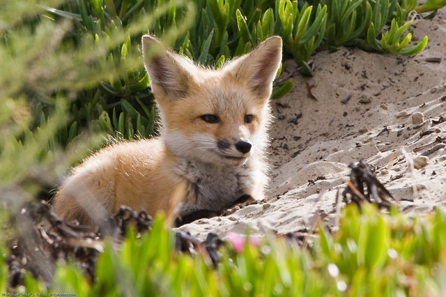
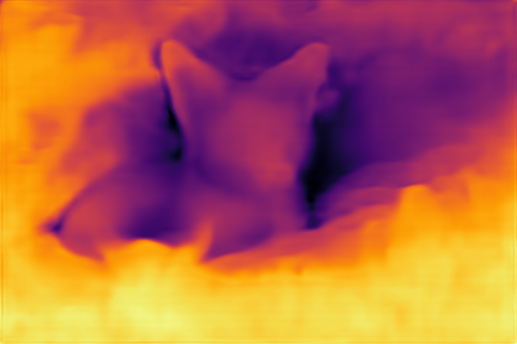

# Dinov2 Depth Estimation

This example runs Dinov2 Depth Estimation with AMLNN. The full flow is:

1. Prepare or download an ONNX model.
2. Convert the ONNX model to an ADLA model.
3. Run the Python demo with ADLA model.
4. Run the C++ (Linux/Android) demo with the ADLA model.
5. Check detection images/results.

## Directory layout
```bash
examples/dinov2_dd/
├── cpp/               # C++ demo and build scripts
├── input/             # Input images for demo
├── model/             # Put ONNX and ADLA models here
├── py/                # Python conversion and demo scripts
└── result.png         # Example output
```

## License

This example code is licensed under the Apache License 2.0. See the repository root [LICENSE](../../LICENSE) file for the complete license terms.

The DINOv2 ViT-B/14 backbone and NYU Depth V2 DPT depth-estimation head used in this example originate from the [Meta AI DINOv2 project](https://github.com/facebookresearch/dinov2). The original DINOv2 code and model weights are released under the Apache License 2.0.

The ONNX and ADLA model files distributed for this example are converted and, where applicable, compiled or quantized forms of the original DINOv2 backbone and DPT depth-head weights. These model files have been modified from the original distribution through model export, graph conversion, separation of the backbone and depth head, compilation, and/or quantization.

The converted model files are redistributed under the Apache License 2.0. When redistributing these files, you must:

* provide recipients with a copy of the Apache License 2.0;
* retain applicable copyright, patent, trademark, and attribution notices;
* preserve this notice or an equivalent notice identifying the original DINOv2 project; and
* clearly state that the model files were converted or otherwise modified from the original model weights.

> Copyright (c) Meta Platforms, Inc. and affiliates.
>
> Licensed under the Apache License, Version 2.0 (the "License");  
> you may not use this file except in compliance with the License.  
> You may obtain a copy of the License at
>
>     http://www.apache.org/licenses/LICENSE-2.0
>
> Unless required by applicable law or agreed to in writing, software  
> distributed under the License is distributed on an "AS IS" BASIS,  
> WITHOUT WARRANTIES OR CONDITIONS OF ANY KIND, either express or implied.  
> See the License for the specific language governing permissions and  
> limitations under the License.

The preprocessing, inference, and postprocessing implementation in this example was developed for this project with AI assistance and was subsequently reviewed and adapted by the project maintainers.

## 1. Prepare The ONNX Model

### Download onnx

Download the prepared onnx model and put it under `examples/dinov2_dd/model/`:

[Download Dino Backbone ONNX model here!](https://pub-8378326bd0fe4b1d9312a3847f6316a2.r2.dev/model_zoo/dinov2_dd/dinov2_vitb14_backbone_sim.onnx)

[Download Dino NYU DPT ONNX model here!](https://pub-8378326bd0fe4b1d9312a3847f6316a2.r2.dev/model_zoo/dinov2_dd/dinov2_vitb14_nyu_dpthead_sim.onnx)

Place the downloaded onnx files under `examples/dinov2_dd/model/`

## 2. Model Conversion
The model conversion is done using the export_adla.py script.
```bash
cd py
Usage:   python export_adla.py --backbone-onnx ../model/dinov2_vitb14_backbone_sim.onnx \
                               --classifier-onnx ../model/dinov2_vitb14_nyu_dpthead_sim.onnx \
                               --target-platform 007
```

| Parameter           | Description                                                                                                                                                                                                                             |
| ------------------- | --------------------------------------------------------------------------------------------------------------------------------------------------------------------------------------------------------------------------------------- |
| `--backbone-onnx`   | DINO backbone `.onnx` model path                                                                                                                                                                                                        |
| `--depth-onnx` | DINO linear classifier `.onnx` model path                                                                                                                                                                                               |
| `--target-platform` | Specify target platform. For specific platforms, click [**HERE**](../../docs/mapping.md) to see the full list                                                                                                                           |
| `--adla`            | Output directory for the generated backbone and classifier `.adla` files. Optional; defaults to `../model` if not specified.                                                                                                            |


## 3. Run Python Demo

**Prerequisites:**
- Python 3.10
- Required packages: `amlnn`

**Install dependencies:**
```bash
pip install amlnn_edge_toolkit_lite-1.0.0-cp310-cp310-linux_aarch64.whl
```

**Run on device:**
```bash
python dinov2_dd_inference.py \
    --backbone-model ../model/dinov2_vitb14_backbone_sim.adla \
    --depth-model ../model/dinov2_vitb14_nyu_dpthead_sim.adla \
    --image-dir ../input
```

Argument Descriptions:

| Argument           | Description                                                 |
| ------------------ | ----------------------------------------------------------- |
| `--backbone-model` | Path to the DINOv2 backbone `.adla` model                   |
| `--depth-model`    | Path to the single-input DINOv2 depth-head `.adla` model    |
| `--image-dir`      | Directory containing test images                            |
| `--output-dir`     | Directory for saved depth results. Default: `depth_results` |
| `--min-depth`      | (Optional) Minimum NYU depth value in meters. Default: `0.001`             |
| `--max-depth`      | (Optional) Maximum NYU depth value in meters. Default: `10.0`          |


The script will automatically process all image files (`.jpg`, `.jpeg`, `.png`, `.bmp`) in the current directory and save results to a `{model_name}_result` folder.

## 4. Run C++ Demo

### Build For Android

**Prerequisites:**
- **Android NDK** (r27d recommended) installed on your system.
- **AMLNN Toolkit** downloaded and extracted.
- Prebuilt OpenCV for Android located in the `dependency/opencv/` folder.

**1. Setup Environment:**
Export the paths to your NDK (the toolchain) and AMLNN (the neural network dependency) so the script can find them.
```bash
export ANDROID_NDK_PATH=/path/to/android-ndk-r27d
export AMLNN_HOME=/path/to/amlnn-toolkit/amlnn_runtime
```

**2. Build:**
Navigate to the C++ directory and run the build script.

```bash
cd examples/dinov2_dd/cpp

# Build for 64-bit (arm64-v8a) - Default
./build-android.sh

# Build for 32-bit (armeabi-v7a)
./build-android.sh -a armeabi-v7a
```

The executable will be generated at `build/android/dinov2_dd_demo` (Note: executable name may vary, verify in build folder).

**Run:**

```bash
# Push executable to device
adb shell "mkdir -p /data/local/tmp/" 
adb push build/android/dinov2_dd_demo /data/local/tmp/
adb push ../model/dinov2_vitb14_backbone_sim.adla /data/local/tmp/
adb push ../model/dinov2_vitb14_nyu_dpthead_sim.adla /data/local/tmp/
adb push ../input/ /data/local/tmp/

# Run on device
adb shell
cd /data/local/tmp
chmod +x dinov2_dd_demo
export LD_LIBRARY_PATH=/vendor/lib64 or (/vendor/lib)

# Usage: ./dinov2_dd_demo <backbone.adla> <depth.adla> <image_dir> [min_depth] [max_depth]
./dinov2_dd_demo dinov2_vitb14_backbone_sim.adla dinov2_vitb14_nyu_dpthead_sim.adla input/ 0.001f 10.0f
```

**Note:** Replace `dino.adla` with your actual model file path.

---
### Build For Linux

The Linux build process supports two distinct modes: **Standard Linux cross-compilation** (default) and **Yocto SDK compilation**.

### Mode 1: Standard Linux Cross-Compile (Default)

**Prerequisites:**
- A GCC Cross-Compiler toolchain (GCC 10.3 recommended).
- The toolchain's `bin/` folder must be added to your system's `PATH`.
- Prebuilt OpenCV located in the `dependency/opencv/` folder.
- `AMLNN_HOME` environment variable set

**1. Setup Environment:**
Add your downloaded toolchain to your `PATH` and export the `AMLNN_HOME` variable so the script can find the compiler and neural network dependencies.
```bash
# Export the AMLNN path
export AMLNN_HOME=/path/to/amlnn-toolkit/amlnn_runtime

# For 64-bit (aarch64) builds, add the 64-bit toolchain to PATH:
export PATH=/path/to/gcc-arm-10.3-2021.07-x86_64-aarch64-none-linux-gnu/bin:$PATH

# OR for 32-bit (arm) builds, add the 32-bit toolchain to PATH:
export PATH=/path/to/gcc-arm-10.3-2021.07-x86_64-arm-none-linux-gnueabihf/bin:$PATH
```

**2. Build:**
```bash
cd examples/dinov2_dd/cpp
# Build for 64-bit (Default)
./build-linux.sh

# Build for 32-bit
./build-linux.sh -b 32
```

*(Optional Override):* If your compiler has a different prefix name (for example, `aarch64-linux-gnu` instead of `aarch64-none-linux-gnu`), you can override the default by setting the `GCC_COMPILER` variable:
```bash
GCC_COMPILER=aarch64-linux-gnu ./build-linux.sh
```

The executable will be generated at `build/linux/64/dinov2_dd_demo` (or `build/linux/32/dinov2_dd_demo`).

### Mode 2: Yocto/Debian/Armbian Build

**Prerequisites:**
- Yocto SDK installed
- CMake Toolchain file available
- Prebuilt OpenCV located at `../../../dependency/opencv/` (relative to the script directory)

**Build:**
```bash
# Export the AMLNN path
export AMLNN_HOME=/path/to/amlnn-toolkit/amlnn_runtime

cd examples/dinov2_dd/cpp

# Build for Yocto 64-bit (Default)
./build-linux.sh -m yocto -s /path/to/yocto_sdk_root -t /path/to/toolchain.cmake

# Or build for Yocto 32-bit
./build-linux.sh -m yocto -b 32 -s /path/to/yocto_sdk_root -t /path/to/toolchain.cmake
```
*(Note: You can also use the `YOCTO_SDK_ROOT` and `TOOLCHAIN_FILE` environment variables instead of passing the `-s` and `-t` flags).*

The executable will be generated at `build/yocto/64/dinov2_dd_demo` (or `build/yocto/32/dinov2_dd_demo`).

---

**Run:**

```bash
# Push executable and assets to device (adjust build path if using Yocto)
adb shell "mkdir -p /data/local/tmp/" 
adb push build/android/dinov2_dd_demo /data/local/tmp/
adb push ../model/dinov2_vitb14_backbone_sim.adla /data/local/tmp/
adb push ../model/dinov2_vitb14_nyu_dpthead_sim.adla /data/local/tmp/
adb push ../input/ /data/local/tmp/

# Run on device
adb shell
cd /data/local/tmp
chmod +x dinov2_dd_demo

# Usage: ./dinov2_dd_demo <backbone.adla> <depth.adla> <image_dir> [min_depth] [max_depth]
./dinov2_dd_demo dinov2_vitb14_backbone_sim.adla dinov2_vitb14_nyu_dpthead_sim.adla input/ 0.001f 10.0f
```

**Note:** Replace with your actual model file name.

## 5. Results

**Performance Feedback**

By setting the loglevel to INFO, the program provides real-time performance metrics upon completion. The console log will display essential hardware and execution details, including:
- Hardware Information: System and ADLA library versions.
- Model Overview: Basic input/output configurations.
- NPU Metrics: Total inference time (latency) and total DRAM bandwidth consumption.

**Depth Estimation Result**




