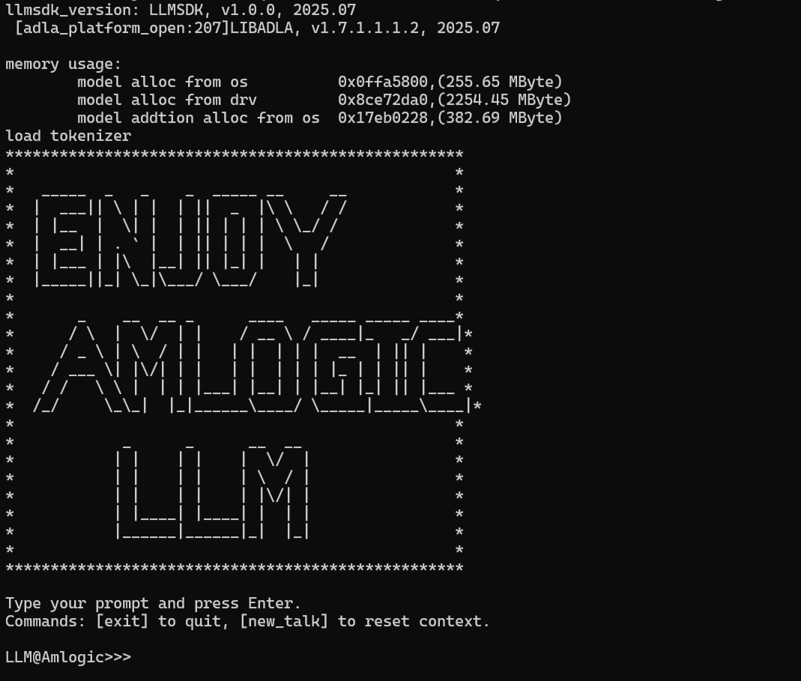

# LLM Examples

## Resource Requirements

| Model | CPU | NPU | GPU |
| :--- | :--- | :--- | :--- |
| Qwen(0.5B) | Minimum cores: 4<br>DDR: 4G (2G reserved for NN) | At least 3.2T | NO |
| Qwen(1.8B) | Minimum cores: 4<br>DDR: 8G (6G~6.5G reserved for NN) | At least 3.2T | NO |
| Gemma(2B) | Minimum cores: 4<br>DDR: 8G (5.5G~6G reserved for NN) | At least 3.2T | NO |


 ## Performance 

ADLA2: A311D2_3.2T / S905X5_4T

| LLM Model | SOC | Dtype | Seqlen | Max_Context | New_Tokens | TTFT(ms) | Tokens/s | memory(G) |
| :--- | :--- | :--- | :--- | :--- | :--- | :--- | :--- | :--- |
| DeepSeek-R1 | A311D2 | w8a8 | 64 | 320 | 256 | 927.79 | 4.95 | 1.99 |
| DeepSeek-R1 | S905X5 | w8a8 | 64 | 320 | 256 | 514.86 | 4.47 | 1.73 |
| Gemma-2B | A311D2 | w8a8 | 64 | 320 | 256 | 846.66 | 2.64 | 3.93 |
| Gemma-2B | S905X5 | w8a8 | 64 | 320 | 256 | 482.92 | 3.08 | 2.77 |
| Gemma-3-1B | A311D2 | w8a8 | 64 | 320 | 256 | 702.88 | 5.08 | 1.9 |
| Gemma-3-1B | S905X5 | w8a8 | 64 | 320 | 256 | 468.97 | 6.44 | 1.38 |
| Llama3.2_1B | A311D2 | w8a8 | 64 | 320 | 256 | 711.64 | 5.92 | 1.69 |
| Llama3.2_1B | S905X5 | w8a8 | 64 | 320 | 256 | 695.92 | 5.42 | 1.5 |
| Qwen1.5_1.8B | A311D2 | w8a8 | 64 | 320 | 256 | 794.50 | 4.52 | 2.2 |
| Qwen1.5_1.8B | S905X5 | w8a8 | 64 | 320 | 256 | 983.93 | 4.47 | 1.9 |
| Qwen2.5_0.5B | A311D2 | w8a8 | 64 | 320 | 256 | 400.44 | 10.50 | 0.88 |
| Qwen2.5_0.5B | S905X5 | w8a8 | 64 | 320 | 256 | 400.37 | 10.97 | 0.66 |
| Qwen2.5_1.5B | A311D2 | w8a8 | 64 | 320 | 256 | 882.49 | 3.94 | 2.37 |
| Qwen2.5_1.5B | S905X5 | w8a8 | 64 | 320 | 256 | 874.06 | 4.16 | 1.76 |
| TinyLlama-1.1B-Chat-v1.0 | A311D2 | w8a8 | 64 | 320 | 256 | 763.07 | 6.51 | 1.31 |
| TinyLlama-1.1B-Chat-v1.0 | S905X5 | w8a8 | 64 | 320 | 256 | 1161.82 | 5.85 | 1.15 |
| TinyLlama-1.1B-Chat-v0.4 | A311D2 | w8a8 | 64 | 320 | 256 | 740.02 | 6.38 | 1.31 |
| TinyLlama-1.1B-Chat-v0.4 | S905X5 | w8a8 | 64 | 320 | 256 | 733.01 | 6.28 | 1.11 |


## Download Models

Pre-quantized ADLA models are available on Hugging Face:

- **Qwen2.5-0.5B (A311D2)**: [Hugging Face Repository](https://huggingface.co/Amlogic-NN/Qwen2.5-0.5B-Instruct_quant_i8/blob/main/Qwen2.5-0.5B-Instruct_quant_i8_a311d2.adla)


## Run LLM on Amlogic Devices

### CPP
To compile the CPP project using Android NDK, please follow these steps:

1. **Get the llmsdk library and header files**:
   Clone the `amlnn-toolkit` repository to get the necessary libraries for compilation.
   ```bash
   # Clone to the parent directory of amlnn-model-playground
   git clone https://github.com/Amlogic-NN/amlnn-toolkit.git
   ```

2. **Set the NDK path**:
   ```bash
   export NDK_PATH=/your/ndk/path/android-ndk-r25c
   ```

3. **Add NDK to your PATH**:
   ```bash
   export PATH=$NDK_PATH:$PATH
   ```

4. **Compile**:
   Navigate to the `cpp` directory and run `build-android.sh`:
   ```bash
   cd examples/LLMs/cpp
   ./build-android.sh
   ```

5. **Run**:
   Push the compiled executable, model, and tokenizer to your Android device.

   Optional configuration:
   - **Push `llmsdk.so`**: If not already present on the device, push it to `/data/local/tmp`.
   - **Set permissions**:
     ```bash
     chmod +x demo_llm_main
     ```
   - **Set environment variable**:
     ```bash
     export LD_LIBRARY_PATH=$LD_LIBRARY_PATH:/vendor/lib64/:/data/local/tmp
     ```

   Then execute:
   ```bash
   ./demo_llm_main Qwen2.5-0.5B-Instruct_quant_i8_a311d2.adla tokenizer.json
   ```

### Python (Arm-based Ubuntu)

**Hardware Requirements**:
- SOC: A311D2 or S905X5
- DDR: ≥ 4GB  

**System Requirements**:
- OS: Ubuntu 22.04

> [!CAUTION]
> The system image is awaiting release; there is currently no official image available.
- Python: 3.10

**Verify NPU Driver Version**:
Execute the following commands in the serial console to check the NPU driver version:
```bash
dmesg | grep adla
strings /usr/lib/libadla.so | grep LIBADLA
```
The driver version must be 1.7.x or higher.

1. **Create Python Environment**:
   ```bash
   # Install Miniforge if needed
   wget https://github.com/conda-forge/miniforge/releases/latest/download/Miniforge3-Linux-aarch64.sh
   bash Miniforge3-Linux-aarch64.sh
   
   # Create Environment
   conda create -n nnserver_310 python=3.10 -y
   conda activate nnserver_310
   ```

2. **Get and install amlllm python whl**:
   Clone the `amlnn-toolkit` repository to get the necessary libraries for compilation.
   ```bash
   # Clone to the parent directory of amlnn-model-playground
   git clone https://github.com/Amlogic-NN/amlnn-toolkit.git ../../../amlnn-toolkit

   # Install python whl
   pip install ../../../amlnn-toolkit/amlnn_edge_toolkit_lite/whl/amlllm-1.0.0-cp310-cp310-linux_aarch64.whl
   ```

3. **Run**:
   Navigate to the`py`directory and run`simple_chat.py`:
   ```bash
   cd examples/LLMs/py
   python simple_chat.py --model <model_path> --tokenizer <tokenizer_path> [options]
   ```

4. **Parameters**:
   - `--model`: (Required) Path to LLM model file
   - `--tokenizer`: (Required) Path to tokenizer resources
   - `--sampling-mode`: Sampling mode, options: `argmax`, `top_p`, `top_k`, default: `argmax`
   - `--top-k`: Top-K parameter, default: 3
   - `--top-p`: Top-P parameter, default: 0.9
   - `--temperature`: Softmax temperature parameter, default: 1.0
   - `--repeat-penalty`: Repeat penalty factor, default: 1.1
   - `--loglevel`: Log level, options: `DEBUG`, `INFO`, `WARNING`, `ERROR`, default: `ERROR`
   - `--model-type`: Model type template, options: `none`, `qwen`, `deepseek`, `gemma`, `gemma3`, `llama`, `tiny_llama`, `tiny_llama_v0_4`, `phi_1_5`, `phi_2`, default: `none`

5. **Usage Examples**:
   ```bash
   # Using Qwen model
   python simple_chat.py --model Qwen2.5-0.5B-Instruct_quant_i8_a311d2.adla --tokenizer tokenizer.json --model-type qwen
   
   # Using Top-P sampling mode
   python simple_chat.py --model model.adla --tokenizer tokenizer.json --sampling-mode top_p --top-p 0.9 --temperature 0.8
   
   # Using Top-K sampling mode
   python simple_chat.py --model model.adla --tokenizer tokenizer.json --sampling-mode top_k --top-k 5
   ```

6. **Interactive Commands**:
   After the program starts, you enter an interactive interface that supports the following commands:
   - Direct input: Enter text and press Enter, the model will generate a response (streaming output)
   - `exit`: Exit the program
   - `new_talk`: Clear conversation history and start a new conversation
   - `break`: Interrupt the currently generating response
   - `Ctrl+C`: Send interrupt signal

## Result

 
