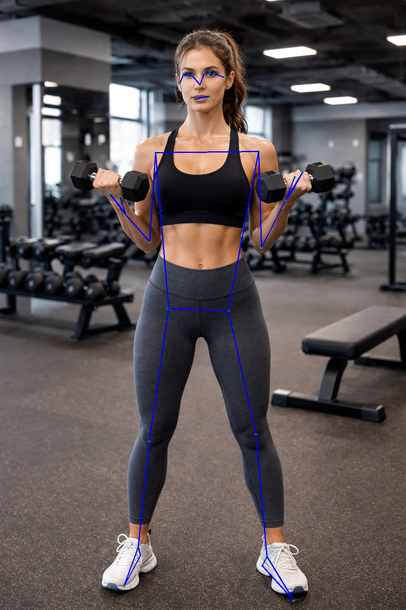

# blazepose_landmark

## 1.Overview

​		BlazePose Landmark builds upon the detected ROI to predict 33 precise body keypoints, enabling full-body pose estimation with high accuracy and temporal stability. Its efficient design makes it suitable for applications such as fitness tracking, motion analysis, augmented reality, and real-time human–computer interaction.

## 2.Model Download

- **Open Source model**

  - **Open Source projects:** https://github.com/google-ai-edge/mediapipe/tree/master

  - **Download weights**

    wget https://storage.googleapis.com/mediapipe-assets/pose_landmark_full.tflite

## 3. Model Conversion

```
cd model
Usage:   ./adla_convert.sh model_path adla_toolkit_path target_platform

example
 ./adla_convert.sh pose_detection.tflite /xxxx/adla-toolkit-binary-3.2.9.3 PRODUCT_PID0XA005
 ./adla_convert.sh pose_detection.tflite /xxxx/adla-toolkit-binary-3.2.9.3 PRODUCT_PID0XA005
 ./adla_convert.sh pose_detection.tflite /xxxx/adla-toolkit-binary-3.2.9.3 PRODUCT_PID0XA005
```

| Parameter         | Description                                                  |
| ----------------- | ------------------------------------------------------------ |
| model_path        | onnx model path                                              |
| adla_toolkit_path | path to adla_toolkit                                         |
| target_platform   | Specify target platform. for A311D2: PRODUCT_PID0XA003. for S905X5: PRODUCT_PID0XA005 |


## 4. Demo Run

### CPP

#### 1. Compile

**Prerequisites:**

- Android NDK (r25e recommended)
- `ANDROID_NDK_PATH` environment variable set

**Build:**
```bash
# Build for arm64-v8a
cd examples/blazepose_landmark/cpp
./build-android.sh -a arm64-v8a
```

The executable will be generated at `build/android/blazepose_landmark_demo` (Note: executable name may vary, verify in build folder).

#### 2. Run

```bash
# Push executable to device
adb push build/android/blazepose_landmark_demo /data/local/tmp/
adb push model/blazepose_landmark_full_int16_A311D2.adla /data/local/tmp/
adb push test_image.jpg /data/local/tmp/

# Run on device
adb shell
cd /data/local/tmp
chmod +x blazepose_landmark_demo
export LD_LIBRARY_PATH=/vendor/lib64 or (/vendor/lib)

# Usage: ./blazepose_landmark_demo <model_path> <image_path>
./blazepose_landmark_demo blazepose_landmark_full_int16_A311D2.adla test_image.jpg"
```

**Note:** Replace `blazepose_landmark_full_int16_A311D2.adla` with your actual model file path.

### Python

**Prerequisites:**
- Python 3.10
- Required packages: `numpy`, `opencv-python`, `amlnnlite`

**Install dependencies:**
```bash
pip install numpy opencv-python amlnnlite-1.0.0-cp310-cp310-linux_aarch64.whl
```

**Run on device:**
```bash
python blazepose_landmark.py --model-path ./blazepose_landmark_full_int16_A311D2.adla
```

The script will automatically process all image files (`.jpg`, `.jpeg`, `.png`, `.bmp`) in the current directory and save results to a `{model_name}_result` folder.

## 5.Results
The program will print the detection count and inference time. The result image with bounding boxes will be saved to the specified output path (`result.jpg` by default).


You can pull the result image back to view it:
```bash
adb pull result.jpg.
```


