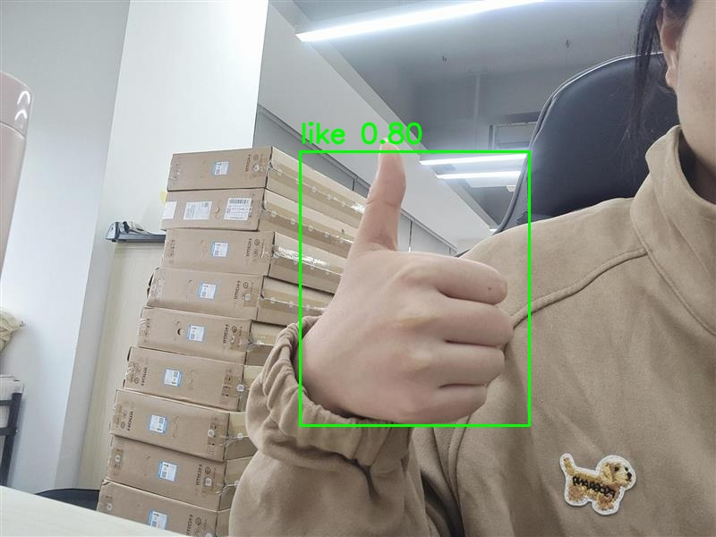
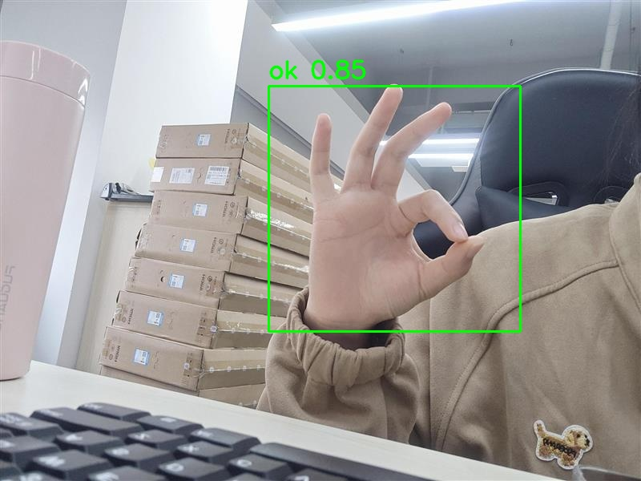

# Gesture

This example runs Gesture with AMLNN. The full flow is:

1. Prepare or download an ONNX model.
2. Convert the ONNX model to an ADLA model.
3. Run the Python demo with the ADLA model.
4. Run the C++ (Linux/Android) demo with the ADLA model.
5. Check gesture detection results.

## Directory Layout

```bash
examples/gesture/
├── cpp/               # C++ demo and build scripts
├── input/             # Input images for demo
├── model/             # Put ONNX and ADLA models here
├── py/                # Python conversion and demo scripts
└── result.jpg         # Example detection output
```

## License

This example code is licensed under the Apache License 2.0. See the repository root [LICENSE](../../LICENSE) file for details.

This model architecture and its pre-trained weights were originally sourced from Aliyun / [ModelScope](https://www.modelscope.cn/models/IoT-Edge/Gesture_Detect/summary), which officially lists this specific release under the **Apache License 2.0**.

*Disclaimer:* While the upstream provider (ModelScope) has designated this release as Apache 2.0, the model architecture shares structural similarities with YOLO-family models. It is the end-user's responsibility to verify the upstream licensing terms and HaGRID dataset usage terms before using these models for independent commercial redistribution. The included labels file contains the 19 gesture category names derived from the HaGRID dataset, provided here for convenience.

The model pre-processing and post-processing code in this example was partially generated by AI. If any part is similar to existing work and causes concern, please contact us and we will remove or adjust it.

## 1. Prepare The ONNX Model

### Export ONNX

Model source:

[ModelScope Gesture Detect](https://www.modelscope.cn/models/IoT-Edge/Gesture_Detect/files)

Install the required packages:

```bash
pip install torch torchvision onnx modelscope
```

Run the ONNX download/export script:

```bash
cd examples/gesture/py
python onnx_download.py
```

Place the exported `gesture.onnx` under `examples/gesture/model/`.

Expected path:

```text
examples/gesture/model/gesture.onnx
```

## 2. Convert ONNX To ADLA

Run the ADLA export script from `examples/gesture/py`:

```bash
cd examples/gesture/py
python export_adla.py \
  --onnx ../model/gesture.onnx \
  --dataset-path ../../../resource/detection_dataset.txt \
  --target-platform 007 \
  --output-dir ../model
```

| Parameter           | Description                                                                                                                                      |
| ------------------- | ------------------------------------------------------------------------------------------------------------------------------------------------ |
| `--onnx`            | Path to the Gesture `.onnx` model.                                                                                                               |
| `--dataset-path`    | (Optional) Path to a `.txt` file containing the input paths used for quantization calibration. Required for the current `w8a8` configuration.[1] |
| `--target-platform` | Target platform ID. See the full list of supported platforms [**HERE**](../../docs/mapping.md).                                                  |
| `--output-dir`      | (Optional) Directory where the generated `.adla` model will be saved. Defaults to `../model`.                                                    |

> **[1] Quantization dataset note**
>
> The current Gesture export configuration uses `w8a8`, which requires a calibration dataset. If no dataset is provided, AMLNN generates random calibration data instead of failing, which can severely degrade model accuracy.
>
> `activation_dtype` does not apply to `w8a8`.

After conversion, AMLNN's generated filename is preserved.

Expected model path:

```text
examples/gesture/model/gesture_w8a8.adla
```

## 3. Run Python Demo

### Prerequisites

* Python 3.10
* Required packages: `numpy`, `opencv-python`, `amlnn`

### Install Dependencies

```bash
pip install numpy opencv-python amlnn_edge_toolkit-1.0.0-cp310-cp310-linux_aarch64.whl
```

### Run on Device

```bash
python gesture_inference.py \
    --adla ../model/gesture_w8a8.adla \
    --image-dir ../input
```

Argument Descriptions:

| Argument      | Description                                       |
| ------------- | ------------------------------------------------- |
| `--adla`      | Path to the Gesture `.adla` model.                |
| `--image-dir` | Directory containing test images.                 |
| `--top1-only` | (Optional) Keep only the highest-score detection. |

The script will automatically process all image files (`.jpg`, `.jpeg`, `.png`, `.bmp`) in the specified image directory and save the detection results to the model result directory.

## 4. Run C++ Demo

### Build For Android

#### Prerequisites

* **Android NDK** (r27d recommended) installed on your system.
* **AMLNN Toolkit** downloaded and extracted.
* Prebuilt OpenCV for Android located in the `dependency/opencv/` folder.

#### 1. Setup Environment

Export the paths to your NDK (the toolchain) and AMLNN (the neural network dependency) so the script can find them.

```bash
export ANDROID_NDK_PATH=/path/to/android-ndk-r27d
export AMLNN_HOME=/path/to/amlnn-toolkit/amlnn_runtime
```

#### 2. Build

Navigate to the C++ directory and run the build script.

```bash
cd examples/gesture/cpp

# Build for 64-bit (arm64-v8a) - Default
./build-android.sh

# Build for 32-bit (armeabi-v7a)
./build-android.sh -a armeabi-v7a
```

The executable will be generated in the build folder corresponding to the selected Android ABI:

* 64-bit: `build/android/arm64-v8a/gesture_demo`
* 32-bit: `build/android/armeabi-v7a/gesture_demo`

#### 3. Example Run

The following example uses the default 64-bit (`arm64-v8a`) build.

```bash
# Push executable and assets to device
adb shell "mkdir -p /data/local/tmp/"
adb push build/android/arm64-v8a/gesture_demo /data/local/tmp/
adb push ../model/gesture_w8a8.adla /data/local/tmp/
adb push ../input/ /data/local/tmp/

# Run on device
adb shell
cd /data/local/tmp
chmod +x gesture_demo
export LD_LIBRARY_PATH=/vendor/lib64

# Usage: ./gesture_demo <model_path> <image_dir> [--top1-only]
./gesture_demo gesture_w8a8.adla input/
```

To keep only the highest-score detection:

```bash
./gesture_demo gesture_w8a8.adla input/ --top1-only
```

> **Note:** For a 32-bit (`armeabi-v7a`) build, use `build/android/armeabi-v7a/gesture_demo` and the corresponding 32-bit library path. Replace `gesture_w8a8.adla` with your actual generated model filename.

---

### Build For Linux

The Linux build process supports two distinct modes:

1. **Standard Linux cross-compilation** (default)
2. **Yocto SDK compilation**

#### Mode 1: Standard Linux Cross-Compile (Default)

##### Prerequisites

* A GCC Cross-Compiler toolchain (GCC 10.3 recommended).
* The toolchain's `bin/` folder must be added to your system's `PATH`.
* Prebuilt OpenCV located in the `dependency/opencv/` folder.
* `AMLNN_HOME` environment variable set.

##### 1. Setup Environment

Add your downloaded toolchain to your `PATH` and export the `AMLNN_HOME` variable so the script can find the compiler and neural network dependencies.

```bash
# Export the AMLNN path
export AMLNN_HOME=/path/to/amlnn-toolkit/amlnn_runtime

# For 64-bit (aarch64) builds, add the 64-bit toolchain to PATH:
export PATH=/path/to/gcc-arm-10.3-2021.07-x86_64-aarch64-none-linux-gnu/bin:$PATH

# OR for 32-bit (arm) builds, add the 32-bit toolchain to PATH:
export PATH=/path/to/gcc-arm-10.3-2021.07-x86_64-arm-none-linux-gnueabihf/bin:$PATH
```

##### 2. Build

```bash
cd examples/gesture/cpp

# Build for 64-bit (Default)
./build-linux.sh

# Build for 32-bit
./build-linux.sh -b 32
```

> **Optional Override:** If your compiler has a different prefix name (for example, `aarch64-linux-gnu` instead of `aarch64-none-linux-gnu`), you can override the default by setting the `GCC_COMPILER` variable:

```bash
GCC_COMPILER=aarch64-linux-gnu ./build-linux.sh
```

The executable will be generated in the build folder corresponding to the selected architecture:

* 64-bit: `build/linux/64/gesture_demo`
* 32-bit: `build/linux/32/gesture_demo`

#### Mode 2: Yocto/Debian/Armbian Build

##### 1. Prerequisites

* Yocto SDK installed.
* CMake Toolchain file available.
* Prebuilt OpenCV located at `../../../dependency/opencv/` (relative to the script directory).

##### 2. Setup Environment

```bash
# Export the AMLNN path
export AMLNN_HOME=/path/to/amlnn-toolkit/amlnn_runtime
```

##### 3. Build

```bash
cd examples/gesture/cpp

# Build for Yocto 64-bit (Default)
./build-linux.sh -m yocto -s /path/to/yocto_sdk_root -t /path/to/toolchain.cmake

# Build for Yocto 32-bit
./build-linux.sh -m yocto -b 32 -s /path/to/yocto_sdk_root -t /path/to/toolchain.cmake
```

> **Note:** You can also use the `YOCTO_SDK_ROOT` and `TOOLCHAIN_FILE` environment variables instead of passing the `-s` and `-t` flags.

The executable will be generated in the build folder corresponding to the selected architecture:

* 64-bit: `build/yocto/64/gesture_demo`
* 32-bit: `build/yocto/32/gesture_demo`

#### 3. Example Run

The following example uses the default 64-bit Linux build.

```bash
# Push executable and assets to device (adjust build path if using Yocto)
adb shell "mkdir -p /data/local/tmp/"
adb push build/linux/64/gesture_demo /data/local/tmp/
adb push ../model/gesture_w8a8.adla /data/local/tmp/
adb push ../input/ /data/local/tmp/

# Run on device
adb shell
cd /data/local/tmp
chmod +x gesture_demo

# Usage: ./gesture_demo <model_path> <image_dir> [--top1-only]
./gesture_demo gesture_w8a8.adla input/
```

To keep only the highest-score detection:

```bash
./gesture_demo gesture_w8a8.adla input/ --top1-only
```

> **Note:** Replace `gesture_w8a8.adla` with your actual generated model filename. Adjust the executable path if using a 32-bit or Yocto build.

## 5. Results

### Performance Feedback

By setting the log level to `INFO`, the program provides runtime performance information after inference. The console output may include:

* **Hardware Information:** System and ADLA library versions.
* **Model Overview:** Input and output tensor configurations.
* **NPU Metrics:** Inference latency and DRAM bandwidth usage.

### Detection Output

For each input image, the Gesture demo performs gesture detection and generates a visualization containing the detected bounding boxes.

The result image is saved to the Gesture result directory. For example:

```text
gesture_result/
└── test_image_result.jpg
```

You can pull the result image back from the device for inspection:

```bash
adb pull gesture_result/test_image_result.jpg
```




