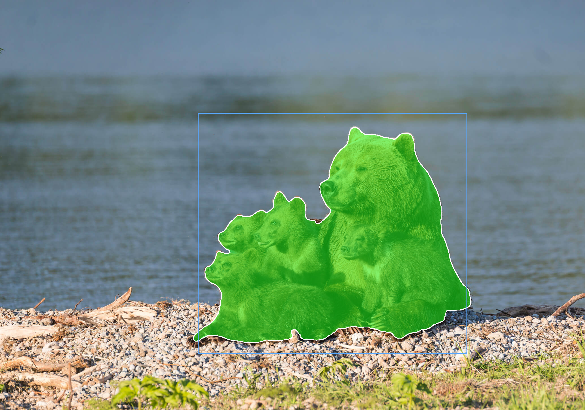

# MobileSAM

This example runs MobileSAM with AMLNN. The full flow is:

1. Run the Python demo with ADLA model.
2. Run the C++ (Linux/Android) demo with the ADLA model.
3. Check detection images/results.

## Directory layout
```bash
examples/mobilesam/
├── cpp/               # C++ demo and build scripts
├── input/             # Input images for demo
├── model/             # Put ONNX and ADLA models here
├── py/                # Python conversion and demo scripts
└── result.jpg         # Example detection output
```

## License
This example code is license under the Apache License 2.0. See the repository root [LICENSE](../../LICENSE) file for details.

The MobileSAM model is provided by a third party, Check and follow the license and usage terms from the model source before redistribution or commercial use.

The model pre-processing and post-processing code in this example was partially generated by AI. If any part is similar to existing work and causes concern, please contact us and we will remove or adjust it promptly.

## 1. Run Python Demo

**Prerequisites:**
- Python 3.10
- Required packages: `amlnn`

**Install dependencies:**
```bash
pip install amlnn_edge_toolkit_lite-1.0.0-cp310-cp310-linux_aarch64.whl
```

**Run on device:**
```bash
python infer_mobilesam_adla_448.py --image ../input/picture5.jpg \
                                   --encoder ../models/448x448/mobile_sam_encoder_448_w8a16.adla \
                                   --decoder ../models/448x448/mobile_sam_decoder_448_no_post_p2_new.adla \
                                   --box 700,400,1650,1250
```
Argument Descriptions:
| Argument         | Description                                                  |
| ----------------- | ------------------------------------------------------------ |
| `--image` | The file path to the input image that you want to process and segment. |
| `--encoder` | The file path to the compiled MobileSAM encoder model in `.adla` format, optimized for a 448x448 input resolution. |
| `--decoder` | The file path to the compiled MobileSAM decoder model in `.adla` format, optimized for a 448x448 input resolution. |
| `--points` | (Optional) Coordinate prompts used to guide the segmentation. Can be a single point formatted as `"x,y,label"` or multiple points separated by semicolons formatted as `"x1,y1,l1;x2,y2,l2"`, where label `1` represents a positive point and `0` represents a negative point. Defaults to `None`. |
| `--box` | (Optional) A bounding box prompt defined by its top-left and bottom-right corners in the format `"x1,y1,x2,y2"`. Unlike point prompts, this does not require padding points. Defaults to `None`. |
| `--decoder-num-points` | (Optional) Specifies the fixed number of input points expected by the decoder network, which is typically set to 2 for the p2 model variant. Defaults to `2`. |
| `--no-padding` | (Optional) A flag that prevents the script from automatically appending a `-1` padding point to your inputs, which is useful when you are already providing a precise 2-point or bounding box prompt. Defaults to `False`. |
| `--mask-index` | (Optional) Forces the selection of a specific generated mask index. If left at the default, the script automatically selects the mask with the highest confidence score. Defaults to `-1`. |
| `--output` | (Optional) The destination file path where the final output image, containing the input image overlaid with the generated segmentation mask, will be saved. Defaults to `"./result_adla_448_overlay.png"`. |

The script will automatically process all image files (`.jpg`, `.jpeg`, `.png`, `.bmp`) in the current directory and save results to a `{model_name}_result` folder.

## 2. Run C++ Demo

### Build For Android

**Prerequisites:**
- **Android NDK** (r27d recommended) installed on your system.
- **AMLNN Toolkit** downloaded and extracted.
- Prebuilt OpenCV for Android located in the `dependency/opencv/` folder.

**1. Setup Environment:**
Export the paths to your NDK (the toolchain) and AMLNN (the neural network dependency) so the script can find them.
```bash
export ANDROID_NDK_PATH=/path/to/android-ndk-r27d
export AMLNN_HOME=/path/to/amlnn-toolkit/amlnn_runtime
```

**2. Build:**
Navigate to the C++ directory and run the build script.

```bash
cd examples/mobilesam/cpp

# Build for 64-bit (arm64-v8a) - Default
./build-android.sh

# Build for 32-bit (armeabi-v7a)
./build-android.sh -a armeabi-v7a
```

The executable will be generated at `build/android/mobilesam_demo` (Note: executable name may vary, verify in build folder).


**Run:**

```bash
# Push executable to device
adb shell "mkdir -p /data/local/tmp/"
adb push build/android/mobilesam_demo /data/local/tmp/
adb push ../models/1024x1024/mobile_sam_encoder_w8a16.adla /data/local/tmp/
adb push ../models/1024x1024/mobile_sam_decoder_no_post_p2.adla /data/local/tmp/
adb push ../input/ /data/local/tmp/

# Run on device
adb shell
cd /data/local/tmp
chmod +x mobilesam_demo
export LD_LIBRARY_PATH=/vendor/lib64 or (/vendor/lib)

# Usage: ./mobilesam_demo <encoder.adla> <decoder.adla> <image> <point|box> <values>
# Point: "x,y,label" or "x1,y1,l1;x2,y2,l2"
# Box:   "x1,y1,x2,y2"
./mobilesam_demo mobile_sam_encoder_w8a16.adla mobile_sam_decoder_no_post_p2.adla ./input/picture5.jpg box 700,400,1650,1250
```

**Note:** Replace `mobilesam_w8a8.adla` with your actual model file path.

---
### Build For Linux

The Linux build process supports two distinct modes: **Standard Linux cross-compilation** (default) and **Yocto SDK compilation**.

### Mode 1: Standard Linux Cross-Compile (Default)

**Prerequisites:**
- A GCC Cross-Compiler toolchain (GCC 10.3 recommended).
- The toolchain's `bin/` folder must be added to your system's `PATH`.
- Prebuilt OpenCV located in the `dependency/opencv/` folder.
- `AMLNN_HOME` environment variable set

**1. Setup Environment:**
Add your downloaded toolchain to your `PATH` and export the `AMLNN_HOME` variable so the script can find the compiler and neural network dependencies.
```bash
# Export the AMLNN path
export AMLNN_HOME=/path/to/amlnn-toolkit/amlnn_runtime

# For 64-bit (aarch64) builds, add the 64-bit toolchain to PATH:
export PATH=/path/to/gcc-arm-10.3-2021.07-x86_64-aarch64-none-linux-gnu/bin:$PATH

# OR for 32-bit (arm) builds, add the 32-bit toolchain to PATH:
export PATH=/path/to/gcc-arm-10.3-2021.07-x86_64-arm-none-linux-gnueabihf/bin:$PATH
```

**2. Build:**
```bash
cd examples/mobilesam/cpp
# Build for 64-bit (Default)
./build-linux.sh

# Build for 32-bit
./build-linux.sh -b 32
```

*(Optional Override):* If your compiler has a different prefix name (for example, `aarch64-linux-gnu` instead of `aarch64-none-linux-gnu`), you can override the default by setting the `GCC_COMPILER` variable:
```bash
GCC_COMPILER=aarch64-linux-gnu ./build-linux.sh
```

The executable will be generated at `build/linux/64/mobilesam_demo` (or `build/linux/32/mobilesam_demo`).

### Mode 2: Yocto Build

**Prerequisites:**
- Yocto SDK installed
- CMake Toolchain file available
- Prebuilt OpenCV located at `../../../dependency/opencv/` (relative to the script directory)

**Build:**
```bash
# Export the AMLNN path
export AMLNN_HOME=/path/to/amlnn-toolkit/amlnn_runtime

cd examples/mobilesam/cpp

# Build for Yocto 64-bit (Default)
./build-linux.sh -m yocto -s /path/to/yocto_sdk_root -t /path/to/toolchain.cmake

# Or build for Yocto 32-bit
./build-linux.sh -m yocto -b 32 -s /path/to/yocto_sdk_root -t /path/to/toolchain.cmake
```
*(Note: You can also use the `YOCTO_SDK_ROOT` and `TOOLCHAIN_FILE` environment variables instead of passing the `-s` and `-t` flags).*

The executable will be generated at `build/yocto/64/mobilesam_demo` (or `build/yocto/32/mobilesam_demo`).

---

**Run:**

```bash
# Push executable and assets to device (adjust build path if using Yocto)
adb shell "mkdir -p /data/local/tmp/"
adb push build/linux/mobilesam_demo /data/local/tmp/
adb push ../models/1024x1024/mobile_sam_encoder_w8a16.adla /data/local/tmp/
adb push ../models/1024x1024/mobile_sam_decoder_no_post_p2.adla /data/local/tmp/
adb push ../input/ /data/local/tmp/

# Run on device
adb shell
cd /data/local/tmp
chmod +x mobilesam_demo

# Usage: ./mobilesam_demo <encoder.adla> <decoder.adla> <image> <point|box> <values>
# Point: "x,y,label" or "x1,y1,l1;x2,y2,l2"
# Box:   "x1,y1,x2,y2"
./mobilesam_demo mobile_sam_encoder_w8a16.adla mobile_sam_decoder_no_post_p2.adla ./input/picture5.jpg box 700,400,1650,1250
```

**Note:** Replace `mobilesam_w8a8.adla` with your actual model file name.

## 3. Results

**Performance Feedback**

By setting the loglevel to INFO, the program provides real-time performance metrics upon completion. The console log will display essential hardware and execution details, including:
- Hardware Information: System and ADLA library versions.
- Model Overview: Basic input/output configurations.
- NPU Metrics: Total inference time (latency) and total DRAM bandwidth consumption.

**Detection Output**

The program will convert the model, print the detection count, and inference time. The result image with bounding boxes will be saved to the specified output path (`model_result/test_image_result.jpg` by default).

You can pull the result image back to view it:
```bash
adb pull model_result/test_image_result.png
```
