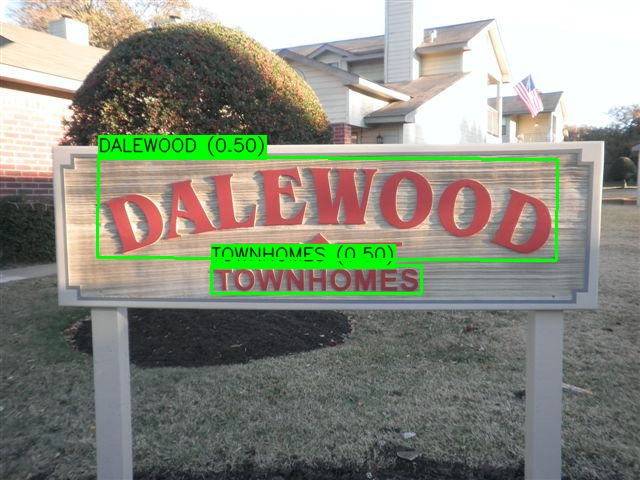

# PaddleOCR v4

This example runs PPOCR with AMLNN. The full flow is:

1. Prepare or download an ONNX model.
2. Convert the ONNX model to an ADLA model.
3. Run the Python or C++ demo with the ADLA model.
4. Check detection images/results.

## Directory Layout

```bash
examples/ppocr_v4_system/
├── cpp/               # C++ demo and build scripts
├── input/             # Input images for demo
├── model/             # Put ONNX and ADLA models here
├── py/                # Python conversion and demo scripts
└── result.jpg         # Example result
```

## License

This example code is licensed under the Apache License 2.0. See the repository root [LICENSE](../../LICENSE) file for details.

This project distributes the PP-OCR detection and recognition models, which were originally developed by Baidu (PaddlePaddle) and retrieved from the official PaddleOCR repository. The model weights and architectures are provided under the permissive Apache 2.0 License. Please ensure you retain the Apache 2.0 license notice if you further redistribute these model files or use them commercially.

The model pre-processing and post-processing code in this example was partially generated by AI. If any part is similar to existing work and causes concern, please contact us and we will remove or adjust it.

## 1. Prepare The ONNX Model

### Download onnx

Download the prepared onnx model and put it under `examples/ppocr_v4_system/model/`:

Detection model: https://pub-8378326bd0fe4b1d9312a3847f6316a2.r2.dev/model_zoo/ppocr_det_v4/ppocr_det_static.onnx

Recognition model: https://pub-8378326bd0fe4b1d9312a3847f6316a2.r2.dev/model_zoo/ppocr_rec_v4/ppocr_rec_static.onnx


Place the downloaded `ppocr_det_static.onnx` and `ppocr_rec_static.onnx` under `examples/ppocr_v4_system/model/`

## 2. Convert ONNX To ADLA

Run the ADLA export script from `examples/ppocr_v4_system/py`:

```bash
cd examples/ppocr_v4_system/py
python export_adla.py \
  --det-onnx ../model/ppocr_det_static.onnx \
  --rec-onnx ../model/ppocr_rec_static.onnx \
  --det-dataset-path ../../../resource/signs_dataset.txt \
  --rec-dataset-path ../../../resource/font_calibration_dataset.txt \
  --target-platform 005 \
  --adla ../model
```

| Parameter         | Description                                                  |
| ----------------- | ------------------------------------------------------------ |
| `--det-onnx`        | Path to Detection `.onnx` model                                          |
| `--rec-onnx`        | Path to Recognition `.onnx` model                                          |
| `--det-dataset-path`      | Path to a `.txt` containing all the paths to the quantization images for Detection model|
| `--rec-dataset-path`      | Path to a `.txt` containing all the paths to the quantization images for Recognition model  |
| `--target-platform`   | Specify target platform. For specific platforms, click [**HERE**](../../docs/mapping.md) to see the full list |
| `--adla` | Output `.adla` file path. Optional; defaults to `../model` if not specified. |

After conversion, the expected model path is:

```text
examples/ppocr_v4_system/model/ppocr_det_static_w8a8.adla
examples/ppocr_v4_system/model/ppocr_rec_static_w8a16.adla
```
## 3. Run Python Demo

**Prerequisites:**
- Python 3.10
- Required packages: `numpy`, `opencv-python`, `amlnn`

**Install dependencies:**
```bash
pip install numpy opencv-python amlnn-1.0.0-cp310-cp310-linux_aarch64.whl
```

**Run on device:**
```bash
python ppocr_inference.py \
    --det-model ../model/ppocr_det_static_w8a8.adla \
    --rec-model ../model/ppocr_rec_static_w8a16.adla \
    --dict-path ../input/ppocr_keys_v1.txt \
    --image-dir ../input
```
Argument Descriptions:
| Argument         | Description                                                  |
| ----------------- | ------------------------------------------------------------ |
| `--det-model` | Path to Detection `.adla` model  |
| `--rec-model` | Path to Recognition `.adla` model  |
| `--dict-path` | Path to PP-OCR dictionary `.txt` file  |
|` --image-dir`   | Directory containing test images |

The script will automatically process all image files (`.jpg`, `.jpeg`, `.png`, `.bmp`) in the current directory and save results to a `{model_name}_result` folder.


## 4. Run C++ Demo

### Build For Android

**Prerequisites:**
- Android NDK (r25e recommended)
- `ANDROID_NDK_PATH` environment variable set

**Build:**
```bash
# Build for arm64-v8a
cd examples/ppocr_v4_system/cpp
AMLNN_HOME=/path/to/amlnn-toolkit ./build-android.sh -a arm64-v8a
```

The executable will be generated at `build/android/ppocr_demo` (Note: executable name may vary, verify in build folder).

#### 2. Run

```bash
# Push executable to device
adb shell "mkdir -p /data/local/tmp/" 
adb push build/android/ppocr_demo /data/local/tmp/
adb push ../model/ppocr_det_static_w8a8.adla /data/local/tmp/
adb push ../model/ppocr_rec_static_w8a16.adla /data/local/tmp/
adb push ../input/ /data/local/tmp/

# Run on device
adb shell
cd /data/local/tmp
chmod +x ppocr_demo
export LD_LIBRARY_PATH=/vendor/lib64 or (/vendor/lib)

# Usage: ./ppocr_demo <det_model.adla> <rec_model.adla> <image_dir> <dict_path>
./ppocr_demo ppocr_det_static_w8a8.adla ppocr_rec_static_w8a16.adla input/ ../input/ppocr_keys_v1.txt
```

**Note:** Replace `ppocr_rec_static_w8a16.adla` with your actual model file path.

---
### Build For Linux

The Linux build process supports two distinct modes: **Standard Linux cross-compilation** (default) and **Yocto SDK compilation**.

#### Mode 1: Standard Linux Cross-Compile (Default)

**Prerequisites:**
- GCC Cross-Compiler toolchain installed
- `GCC_COMPILER` environment variable set to your cross-compiler prefix (defaults to `aarch64-linux-gnu`)
- Prebuilt OpenCV located at `../../../dependency/opencv/` (relative to the script directory)

**Build:**
```bash
# Set cross-compiler prefix (example)
export GCC_COMPILER=/path/to/toolchain/bin/aarch64-linux-gnu
export AMLNN_HOME=/path/to/amlnn-toolkit

# Build for aarch64 (Default)
cd examples/ppocr_v4_system/cpp
./build-linux.sh

# Or build for 32-bit armhf
./build-linux.sh -a armhf
```

The executable will be generated at `build/linux/ppocr_demo` (Note: executable name may vary, verify in build folder).

#### Mode 2: Yocto Build

**Prerequisites:**
- Yocto SDK installed
- CMake Toolchain file available
- Prebuilt OpenCV located at `../../../dependency/opencv/` (relative to the script directory)

**Build:**
```bash
cd examples/ppocr_v4_system/cpp

# Build for Yocto 64-bit (Default)
./build-linux.sh -m yocto -s /path/to/yocto_sdk_root -t /path/to/toolchain.cmake

# Or build for Yocto 32-bit
./build-linux.sh -m yocto -b 32 -s /path/to/yocto_sdk_root -t /path/to/toolchain.cmake
```
*(Note: You can also use the `YOCTO_SDK_ROOT` and `TOOLCHAIN_FILE` environment variables instead of passing the `-s` and `-t` flags).*

The executable will be generated at `build/yocto/64/ppocr_demo` (or `build/yocto/32/ppocr_demo`).

---

**Run:**

```bash
# Push executable and assets to device (adjust build path if using Yocto)
adb shell "mkdir -p /data/local/tmp/" 
adb push build/linux/ppocr_demo /data/local/tmp/
adb push ../model/ppocr_det_static_w8a8.adla /data/local/tmp/
adb push ../model/ppocr_rec_static_w8a16.adla /data/local/tmp/
adb push ../input/ /data/local/tmp/

# Run on device
adb shell
cd /data/local/tmp
chmod +x ppocr_demo

# Usage: ./ppocr_demo <det_model.adla> <rec_model.adla> <image_dir> <dict_path>
./ppocr_demo ppocr_det_static_w8a8.adla ppocr_rec_static_w8a16.adla input/ ../input/ppocr_keys_v1.txt
```

**Note:** Replace `ppocr_rec_static_w8a16.adla` with your actual model file name.

## 5. Results

**Performance Feedback**

By setting the loglevel to INFO, the program provides real-time performance metrics upon completion. The console log will display essential hardware and execution details, including:
- Hardware Information: System and ADLA library versions.
- Model Overview: Basic input/output configurations.
- NPU Metrics: Total inference time (latency) and total DRAM bandwidth consumption.

**Example Result**


```
============================================================
Processing image 1/1: test_sign.jpg
============================================================
    [RESULT] Detected 2 objects.
    --------------------------------------------------------
    [RESULT] Box 0 - Text: [TOWNHOMES]
    [RESULT] Box 1 - Text: [DALEWOOD]
    Image saved to:  ppocr_det_static_w8a8_end2end_result/test_sign_result.jpg

============================================================
```