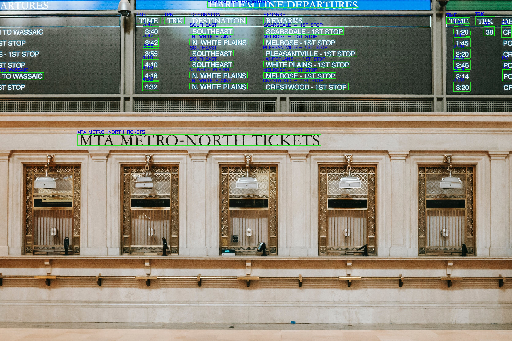

# PP-OCRv5

This example runs [PP-OCRv5](https://github.com/PADDLEPADDLE/PADDLEOCR) text detection and text recognition models with AMLNN. The full flow is:

1. Prepare the ONNX model
2. Convert the ONNX model to ADLA model
3. Run the C++ demo with the ADLA model
4. Check result image

## Directory Layout

```text
examples/ppocrv5-system/
|-- cpp/                  # C++ demo and build scripts
|-- model/                # Put ONNX and ADLA models here
|-- ocr_result_test.jpg   # Example detection output
```

## License

This example code is licensed under the Apache License 2.0. See the repository root [LICENSE](../../LICENSE) file for details.

The PP-OCRv5 model is provided by a third party. Check and follow the license and usage terms from the model source before redistribution or commercial use.

The model pre-processing and post-processing code in this example was generated by AI. If any part is similar to existing work and causes concern, please contact us and we will remove or adjust it.

## 1. Prepare The ONNX Model

### Export ONNX

Model source:

https://www.paddleocr.ai/main/version3.x/module_usage/module_overview.html

Use the Paddle2ONNX plugin of PaddleX to convert the Paddle module to ONNX:

https://www.paddleocr.ai/main/version3.x/inference_deployment/others/obtaining_onnx_models.html

## 2. Convert ONNX To ADLA

### det model

```bash
# Download quantitative image sets from the web and generate the dataset.txt

# convert
python3 export_adla.py \
        --det-onnx ./det_mobile_sim_static.onnx \
        --rec-onnx ./rec_mobile_sim_static.onnx \
        --det-dataset-path ./det_dataset.txt \
        --rec-dataset-path ./rec_dataset.txt \
        --target-platform 007
```

## 3. Run Python Demo

## 4. Run C++ Demo

### Build For Android

**Prerequisites:**

- Android NDK (r25e recommended)
- `ANDROID_NDK_PATH` environment variable set

**Build:**

The executable will be generated at `build/android/paddleocr_sys_demo` (Note: executable name may vary, verify in build folder).


**Run:**

```bash
# Push executable to device
adb push build/android/paddleocr_sys_demo /data/local/tmp/
adb push model/det_mobile_sim_static_w8a16.adla model/rec_mobile_sim_static_w8a16.adla /data/local/tmp/
adb push test.jpg /data/local/tmp/

# Run on device
adb shell
cd /data/local/tmp
chmod +x /data/local/tmp/paddleocr_sys_demo
export LD_LIBRARY_PATH=/vendor/lib64
./paddleocr_sys_demo \
    --image_path=/data/local/tmp/test.jpg \
    --det_model_path=/data/local/tmp/det_mobile_sim_static_w8a16.adla \
    --rec_model_path=/data/local/tmp/rec_mobile_sim_static_w8a16.adla \
    --dict_path=/data/local/tmp/ppocrv5_dict.txt
```

## 5. Results

The demo outputs an image in the current directory containing the detected text boxes and recognized text, named ocr_result_<input_image_filename>.

Pull the result image from the device:

```bash
adb pull /data/local/tmp/ocr_result_test.jpg
```

Example result:

