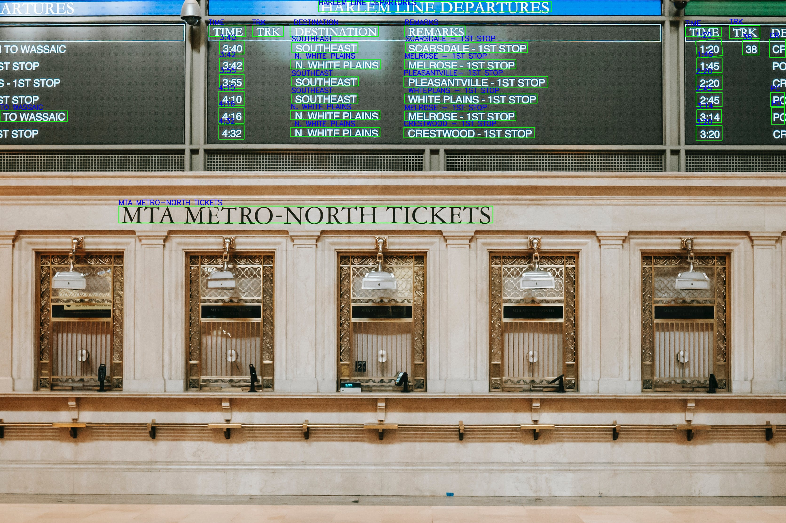

# PP-OCRv6

This example runs [PP-OCRv6](https://github.com/PaddlePaddle/PaddleOCR) text detection and text recognition models with AMLNN.

The sample code in this directory demonstrates how to:

1. Prepare PP-OCRv6 ONNX models
2. Convert ONNX models to ADLA
3. Run the C++ demo using ADLA models
4. View the inference results

## Directory Layout

```text
examples/ppocrv6-system/
|-- cpp/                  # C++ demo and build scripts
|-- model/                # Put ONNX and ADLA models here
|-- py/                   # ADLA export scripts
|-- ppocrv6_dict.txt      # Recognition dictionary file
```

## License

This example code is licensed under the Apache License 2.0. See the repository root [LICENSE](../../LICENSE) file for details.

## 1. Prepare PP-OCRv6 ONNX Models

PP-OCRv6 models can be exported from PaddleOCR v6 using the Paddle2ONNX tool, or downloaded from an official PP-OCRv6 model release.

The PP-OCRv6 detection model expects input name `x` with shape:

- `float32[DynamicDimension.0, 3, DynamicDimension.1, DynamicDimension.2]`

The PP-OCRv6 recognition model expects input name `x` with shape:

- `float32[DynamicDimension.0, 3, 48, DynamicDimension.1]`

Both models expose a single output tensor named `fetch_name_0`.

## 2. Convert ONNX Models to ADLA

### Export PP-OCRv6 models

Use the provided export script to convert both detection and recognition ONNX models to ADLA.

```bash
python3 py/export_adla.py \
    --det-onnx ./model/det_ppocrv6.onnx \
    --rec-onnx ./model/rec_ppocrv6.onnx \
    --det-dataset-path ./det_dataset.txt \
    --rec-dataset-path ./rec_dataset.txt \
    --target-platform 007 \
    --out-dir ./model
```

The export script is configured for PP-OCRv6 input/output node names and uses ADLA quantization settings suitable for v6 inference.

## 3. Run C++ Demo

### Build for Android

**Prerequisites:**

- Android NDK (r25e recommended)
- `ANDROID_NDK_PATH` environment variable set

**Build:**

```bash
cd examples/ppocrv6-system/cpp
./build-android.sh -a arm64-v8a
```

**Run:**

```bash
adb push build/android/paddleocr_sys_demo /data/local/tmp/
adb push model/det_ppocrv6.adla model/rec_ppocrv6.adla /data/local/tmp/
adb push ppocrv6_dict.txt /data/local/tmp/
adb push test.jpg /data/local/tmp/

adb shell
cd /data/local/tmp
chmod +x paddleocr_sys_demo
export LD_LIBRARY_PATH=/vendor/lib64
./paddleocr_sys_demo \
    --image_path=/data/local/tmp/test.jpg \
    --det_model_path=/data/local/tmp/det_ppocrv6.adla \
    --rec_model_path=/data/local/tmp/rec_ppocrv6.adla \
    --dict_path=/data/local/tmp/ppocrv6_dict.txt
```

### Build for Linux

If you prefer Linux, use the same CMake project under `examples/ppocrv6-system/cpp/src` and build with a Linux OpenCV environment.

## 4. Result

The demo saves the visualized OCR result as `ocr_result_<input_image_filename>` in the current working directory. 


If running on device, pull it with:

```bash
adb pull /data/local/tmp/ocr_result_test.jpg
```
