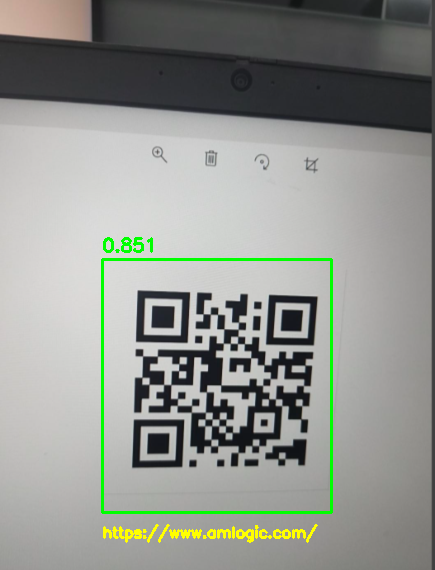

# qrcode

This example runs QR code detection and decoding with AMLNN.

## Directory Layout

```text
examples/qrcode/
|-- cpp/                  # C++ demo and build scripts
|-- input/                # Input images for demo
|-- model/                # Put ONNX and ADLA models here
|-- py/                   # Python conversion and demo scripts
`-- result.jpg            # Example detection output
```

## License

This example code is licensed under the Apache License 2.0. See the repository root [LICENSE](../../LICENSE) file for details.

The qrcode model is provided by a third party. Check and follow the license and usage terms from the model source before redistribution or commercial use.

The model pre-processing and post-processing code in this example was generated by AI. If any part is similar to existing work and causes concern, please contact us and we will remove or adjust it.


## 1. Run Python Demo

### Prerequisites

- Python 3.10
- `numpy`
- `opencv-python`
- AMLNN Python wheel for the target device

Install dependencies on the target device:

```bash
pip install numpy opencv-python amlnn-1.0.0-cp310-cp310-linux_aarch64.whl
```

Run image inference:
```bash
cd examples/qrcode/py
python qrcode.py \
    --model-path ../model/qrcode_int8.tflite \
    --dataset-path ../../../resource/COCO_subset.txt \
    --target-platform 005 \
    --image-dir ../input
```

Python demo arguments:

| Argument | Description |
| --- | --- |
| `--model-path` | Path to the tflite model. |
| `--image-dir` | Directory containing test images.|
| `--dataset-path` | Quantization dataset path. |
| `--target-platform` | Platform ID. A311D2: 003. S905X5: 005. C302X2: 006. A311Y3: 007. |

Then saves results to `qrcode_result`.

## 3. Run C++ Demo

### Build For Android

Prerequisites:

- Android NDK, r25e recommended
- `ANDROID_NDK_PATH`, `ANDROID_NDK`, or `ANDROID_NDK_HOME` set
- `AMLNN_HOME` pointing to the AMLNN toolkit

Build:

```bash
# Build for arm64-v8a
cd examples/qrcode/cpp
AMLNN_HOME=/path/to/amlnn-toolkit ./build-android.sh -a arm64-v8a
```

The executable is generated at:
```text
examples/qrcode/cpp/build/android/qr_demo
```
### Run On Device

Push files:

```bash
adb push build/android/qr_demo /data/local/tmp/
adb push ../model/qrcode_int8_A311D2.adla /data/local/tmp/
adb push ../input /data/local/tmp/qrcode_input
```

Run:

```bash
adb shell
cd /data/local/tmp
chmod +x qr_demo
export LD_LIBRARY_PATH=/vendor/lib64
./qr_demo qrcode_int8_A311D2.adla ./qrcode_input
```

Usage:

```text
./qr_demo <model.adla> <image_dir>
```

## 4.Results

**Detection Output**

For each image, the program prints the processing information, including inference performance (average time, FPS, and bandwidth), detection results (number of objects, confidence score, bounding box coordinates, and decoded QR code content), and the path to the saved output image. 
The output images, featuring bounding boxes and decoded QR code results, will be saved to the `qrcode_result` folder. You can pull the result folder back to view it:
```bash
adb pull /data/local/tmp/qrcode_result
```

