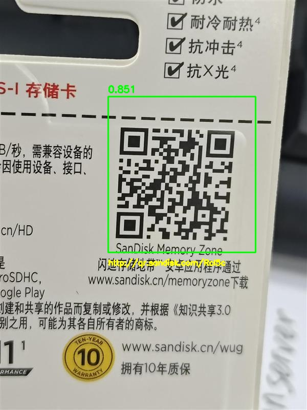
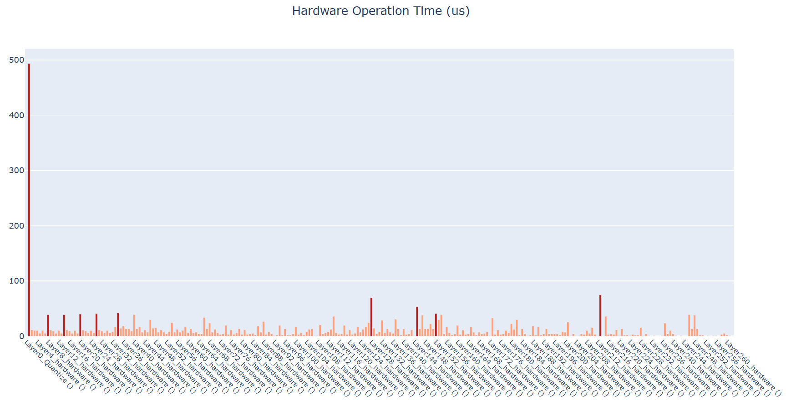

# qrcode

## 1.Overview


## 2.Model Download

- **Open Source model**

  - **Open Source projects:** 

  - **Export Model Step:**	

    - **Install ultralytics**

        pip install torch==2.4.1

        pip install torchvision==0.19.1

        pip install ultralytics==8.3.0

    - **Download weights**

      

    - **Export Model**

    


- **Exported Model**

  ​	link to amlogic server( **onnx model   or quantized tflite**)

  

## 3. Model Conversion

```
cd model
Usage:   ./adla_covnert.sh model_path adla_tookkit_path target_platform

example
 
```

| Parameter         | Discription                                                  |
| ----------------- | ------------------------------------------------------------ |
| model_path        | onnx model path                                              |
| adla_tookkit_path | path to adla_toolkit                                         |
| target_platform   | Specify target platform. for A311D2 : PRODUCT_PID0XA003. for S905X5:  PRODUCT_PID0XA005 |


## 4. Demo Run

### CPP

#### 1. Compile

**Prerequisites:**
- Android NDK (r25e recommended)
- `ANDROID_NDK_PATH` environment variable set

**Build:**
```bash
# Build for arm64-v8a
cd examples/qrcode/cpp
./build-android.sh -a arm64-v8a
```

The executable will be generated at `build/android/qrcode_demo` (Note: executable name may vary, verify in build folder).

#### 2. Run

```bash
# Push executable to device
adb push build/android/qrcode_demo /data/local/tmp/
adb push model/qrcode_int8_A311D2.adla /data/local/tmp/
adb push imgs /data/local/tmp/

# Run on device
adb shell
cd /data/local/tmp
chmod +x qrcode_demo
export LD_LIBRARY_PATH=/vendor/lib64 or (/vendor/lib)

# Usage: ./qrcode_demo <model_path> <image_dir>
./qrcode_demo gesture_int8_A311D2.adla ./imgs
```

**Note:** Replace `gesture_int8_A311D2.adla` with your actual model file path.

### Python

**Prerequisites:**
- Python 3.10
- Required packages: `numpy`, `opencv-python`, `amlnnlite`

**Install dependencies:**
```bash
pip install numpy opencv-python amlnnlite-1.0.0-cp310-cp310-linux_aarch64.whl
```

**Run on device:**
```bash
python qrcode.py \
    --model-path ./qrcode_int8_A311D2.adla \
    --image-dir ./imgs \
    --run-cycles 1 \
    --loglevel INFO
```

Argument Descriptions:
| Argument         | Description                                                  |
| ----------------- | ------------------------------------------------------------ |
| --board-work-path       | Work path on board, default is /data/local/tmp    |
| --model-path | path to .adla model  |
| --image-dir   | Directory containing test images |
| --run-cycles   | Number of inference cycles, default is 1 |
| --loglevel   | Logging level: DEBUG / INFO / WARNING / ERROR, default is WARNING |

The script will automatically process all image files (`.jpg`, `.jpeg`, `.png`, `.bmp`) in the current directory and save results to a `{model_name}_result` folder.

## 5.Results

**Performance Feedback**

By setting the loglevel to INFO, the program provides real-time performance metrics upon completion. The console log will display essential hardware and execution details, including:
- Hardware Information: System and ADLA library versions.
- Model Overview: Basic input/output configurations.
- NPU Metrics: Total inference time (latency) and total DRAM bandwidth consumption.

**Detection Output**

For each image, the program prints the processing information, including inference performance (average time, FPS, and bandwidth), detection results (number of objects, confidence score, bounding box coordinates, and decoded QR code content), and the path to the saved output image. 

```bash
============================================================
Processing image 1/1: test.jpg
============================================================
I Average time: 6.514913082122803 ms
I FPS: 153.49398803710938
I Bandwidth: 14.548721313476562 Mbytes
    Detected 1 objects:
      1. score=0.851
         box=[211, 188, 499, 492]
         text=http://qr.sandisk.com/Rcl5c
    Result saved to: qrcode_result/test.jpg
```

The output images, featuring bounding boxes and decoded QR code results, will be saved to the `qrcode_result` folder. You can pull the result folder back to view it:
```bash
adb pull /data/local/tmp/gesture_result
```
 


**Profiling Visualization**

When `--loglevel` is set to `INFO`, a successful run of the Python demo will generate a folder named after the model (e.g., {model_name}) in the script directory. This folder contains 5 HTML files that provide a visual and detailed breakdown of per-layer performance:
- `hard_op_chart.html` & `soft_op_chart.html`: Hardware/Software op execution details.
- `dram_rd_chart.html` & `dram_wr_chart.html`: Bandwidth read/write distribution.
- `pie_charts_distribution.html`: Overall resource allocation.

You can pull the result folder back to view it:
```bash
adb pull /data/local/tmp/qrcode_int8_A311D2
```

Taking hard_op_chart.html as an example (shown below), each layer's ADLA operator name includes parentheses containing the index of the corresponding quantized .tflite layer(s); by default, these indices are suppressed, and operators are labeled generically as "hardware" or "software" without numerical suffixes.

