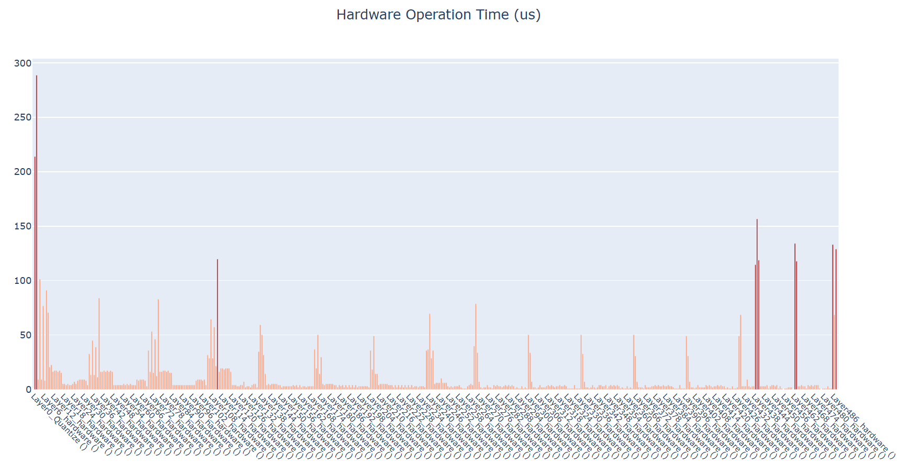

# resnet

## 1.Overview


## 2.Model Download

- **Open Source model**

  - **Open Source projects:** 

  - **Export Model Step:**	

    - **Install ultralytics**

        pip install torch==2.4.1

        pip install torchvision==0.19.1

        pip install ultralytics==8.3.0

    - **Download weights**

      

    - **Export Model**

      ```
      
      ```


- **Exported Model**

  ​	link to amlogic server( **onnx model   or quantized tflite**)

  

## 3. Model Conversion

```
cd model
Usage:   ./adla_covnert.sh model_path adla_tookkit_path target_platform

example

```

| Parameter         | Discription                                                  |
| ----------------- | ------------------------------------------------------------ |
| model_path        | onnx model path                                              |
| adla_tookkit_path | path to adla_toolkit                                         |
| target_platform   | Specify target platform. for A311D2 : PRODUCT_PID0XA003. for S905X5:  PRODUCT_PID0XA005 |


## 4. Demo Run

### CPP

#### 1. Compile

**Prerequisites:**
- Android NDK (r25e recommended)
- `ANDROID_NDK_PATH` environment variable set

**Build:**
```bash
# Build for arm64-v8a
cd examples/resnet/cpp
./build-android.sh -a arm64-v8a
```

The executable will be generated at `build/android/resnet_demo` (Note: executable name may vary, verify in build folder).

#### 2. Run

```bash
# Push executable to device
adb push build/android/resnet_demo /data/local/tmp/
adb push model/res2net50_int8_A311D2.adla /data/local/tmp/
adb push imgs /data/local/tmp/
adb push labels.txt /data/local/tmp/

# Run on device
adb shell
cd /data/local/tmp
chmod +x resnet_demo
export LD_LIBRARY_PATH=/vendor/lib64 or (/vendor/lib)

# Usage: ./resnet_demo <model_path> <image_dir> <labels.txt>
./resnet_demo res2net50_int8_A311D2.adla imgs/ labels.txt
```

**Note:** Replace `res2net50_int8_A311D2.adla` with your actual model file path.

### Python

**Prerequisites:**
- Python 3.10
- Required packages: `numpy`, `opencv-python`, `amlnnlite`

**Install dependencies:**
```bash
pip install numpy opencv-python amlnnlite-1.0.0-cp310-cp310-linux_aarch64.whl
```

**Run on device:**
```bash
python resnet.py \
    --model-path ./res2net50_int8_A311D2.adla \
    --image-dir ./imgs \
    --labels labels.txt \
    --run-cycles 1 \
    --loglevel INFO
```
Argument Descriptions:
| Argument         | Description                                                  |
| ----------------- | ------------------------------------------------------------ |
| --board-work-path       | Work path on board, default is /data/local/tmp    |
| --model-path | path to .adla model  |
| --image-dir   | Directory containing test images |
| --labels   | Path to synset_words.txt or labels.txt |
| --run-cycles   | Number of inference cycles, default is 1 |
| --loglevel   | Logging level: DEBUG / INFO / WARNING / ERROR, default is WARNING |

The script will automatically process all image files (`.jpg`, `.jpeg`, `.png`, `.bmp`) in the current directory and save results to a `{model_name}_result` folder.

## 5.Results
**Performance Feedback**

By setting the loglevel to INFO, the program provides real-time performance metrics upon completion. The console log will display essential hardware and execution details, including:
- Hardware Information: System and ADLA library versions.
- Model Overview: Basic input/output configurations.
- NPU Metrics: Total inference time (latency) and total DRAM bandwidth consumption.

**Classification Output**

For each image, the program prints the Top-5 classification results with their respective scores:
```bash
============================================================
Processing image 1/1: dog.jpg
============================================================                                                                                        Top-5 Results:                                                                                                          
1: Pekinese                     score=9.851644                                                                                 
2: West Highland white terrier  score=5.055449                                                                          
3: Maltese dog                  score=4.796195                                                                                 
4: basenji                      score=3.111045                                                                                 
5: Scotch terrier               score=2.786978                                                                                 ============================================================ 
```
**Profiling Visualization**

After a successful run of the Python demo, a folder named after the model (e.g., `{model_name}`) will be generated in the script directory. This folder contains 5 HTML files that provide a visual and detailed breakdown of per-layer performance:
- `hard_op_chart.html` & `soft_op_chart.html`: Hardware/Software op execution details.
- `dram_rd_chart.html` & `dram_wr_chart.html`: Bandwidth read/write distribution.
- `pie_charts_distribution.html`: Overall resource allocation.

You can pull the result folder back to view it:
```bash
adb pull /data/local/tmp/res2net50_int8_A311D2
```

Taking hard_op_chart.html as an example (shown below), each layer's ADLA operator name includes parentheses containing the index of the corresponding quantized .tflite layer(s); by default, these indices are suppressed, and operators are labeled generically as "hardware" or "software" without numerical suffixes.

