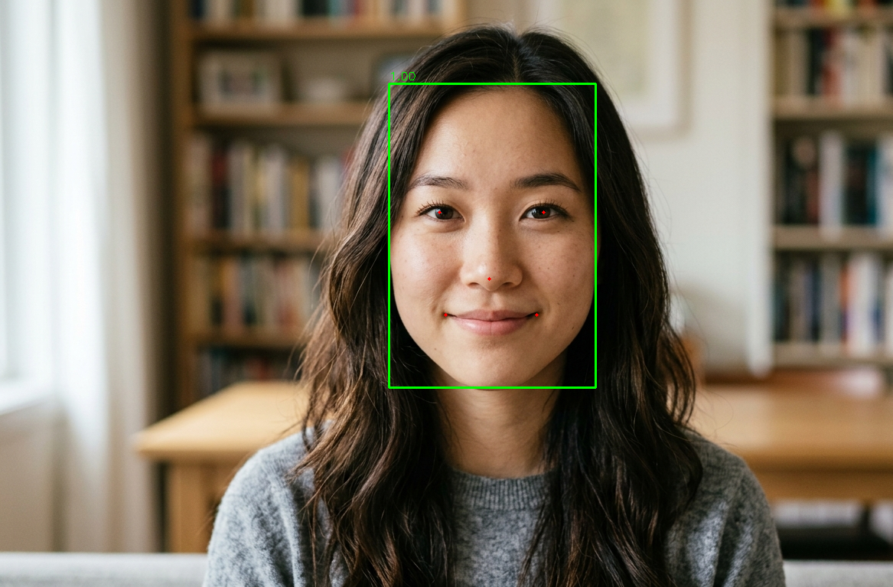

# RetinaFace

This example runs RetinaFace face detection with AMLNN. The full flow is:

1. Prepare or download an ONNX model.
2. Convert the ONNX model to an ADLA model.
3. Run the Python demo with ADLA model.
4. Run the C++ (Linux/Android) demo with the ADLA model.
5. Check detection images/results.

## Directory Layout

```bash
examples/retinaface/
├── cpp/                  # C++ demo and build scripts
├── input/                # Input images for demo
├── model/                # Put ONNX and ADLA models here
├── py/                   # Python conversion and demo scripts
└── result.jpg            # Example detection output
```

## License

This example code is licensed under the Apache License 2.0. See the repository root [LICENSE](../../LICENSE) file for details.

The RetinaFace model is provided by a third party. Check and follow the license and usage terms from the model source before redistribution or commercial use.

The model pre-processing and post-processing code in this example was generated by AI. If any part is similar to existing work and causes concern, please contact us and we will remove or adjust it.

## 1. Prepare The ONNX Model

Model source:

https://www.modelscope.cn/models/iic/cv_resnet50_face-detection_retinaface/files

You can either export the ONNX model from the ModelScope PyTorch model or download the prepared ONNX model.

### Option A: Export ONNX

Install or clone the ModelScope model package:

```bash
git clone https://www.modelscope.cn/iic/cv_resnet50_face-detection_retinaface.git
```

Place `pytorch_model.pt` and `configuration.json` where `py/convert_to_onnx.py` can load it. It is recommended to place both files under `examples/retinaface/py/
`. Then run:

```bash
cd examples/retinaface/py
python convert_to_onnx.py
```

The script writes `retinaface_resnet50.onnx` by default.

### Option B: Download ONNX

Download the prepared ONNX model and put it under `examples/retinaface/model/`:

```text
https://pub-8378326bd0fe4b1d9312a3847f6316a2.r2.dev/model_zoo/retinaface/retinaface_resnet50.onnx
```

Expected path:

```text
examples/retinaface/model/retinaface_resnet50.onnx
```

## 2. Convert ONNX To ADLA

Run the ADLA export script from `examples/retinaface/py`:

```bash
cd examples/retinaface/py
python export_adla.py \
  --onnx ../model/retinaface_resnet50.onnx \
  --dataset-path ../../../resource/detection_dataset.txt \
  --target-platform 007 \
  --adla ../model/RetinaFace_int8_A311D2.adla
```

Arguments:

| Argument | Description |
| --- | --- |
| `--onnx` | Path to the RetinaFace ONNX model. |
| `--dataset-path` | Quantization dataset path. |
| `--target-platform` | Platform ID. A311D2: 003. S905X5: 005. C302X2: 006. A311Y3: 007. |
| `--adla` | Optional output ADLA path. |

After conversion, the expected model path is:

```text
examples/retinaface/model/RetinaFace_int8_A311D2.adla
```

## 3. Run Python Demo

### Prerequisites

- Python 3.10
- `numpy`
- `opencv-python`
- AMLNN Python wheel for the target device

Install dependencies on the target device:

```bash
pip install numpy opencv-python amlnn_edge_toolkit-1.0.0-cp310-cp310-linux_aarch64.whl
```

Run image inference:

```bash
cd examples/retinaface/py
python RetinaFace.py \
  --model-path ../model/RetinaFace_int8_A311D2.adla \
  --image-dir ../input
```

Run camera inference:

```bash
cd examples/retinaface/py
python RetinaFace_camera.py \
  --model-path ../model/RetinaFace_int8_A311D2.adla
```

Python demo arguments:

| Argument | Description |
| --- | --- |
| `--model-path` | Path to the ADLA model. |
| `--image-dir` | Directory containing test images. Used by `RetinaFace.py`. |

The image demo processes `.jpg`, `.jpeg`, `.png`, and `.bmp` files, then saves results to `{model_name}_result`.

## 4. Run C++ Demo

### Build For Android

**Prerequisites:**
- **Android NDK** (r27d recommended) installed on your system.
- **AMLNN Toolkit** downloaded and extracted.
- Prebuilt OpenCV for Android located in the `dependency/opencv/` folder.

**1. Setup Environment:**
Export the paths to your NDK (the toolchain) and AMLNN (the neural network dependency) so the script can find them.
```bash
export ANDROID_NDK_PATH=/path/to/android-ndk-r27d
export AMLNN_HOME=/path/to/amlnn-toolkit/amlnn_runtime
```

**2. Build:**
Navigate to the C++ directory and run the build script.

```bash
cd examples/retinaface/cpp

# Build for 64-bit (arm64-v8a) - Default
./build-android.sh

# Build for 32-bit (armeabi-v7a)
./build-android.sh -a armeabi-v7a
```

The executable will be generated at `build/android/retinaface_demo` (Note: executable name may vary, verify in build folder).

### Run On Device

Push files:

```bash
# Push executable to device
adb shell "mkdir -p /data/local/tmp/" 
adb push build/android/retinaface_demo /data/local/tmp/
adb push ../model/RetinaFace_int8_A311D2.adla /data/local/tmp/
adb push ../input /data/local/tmp/retinaface_input
```

Run:

```bash
adb shell
cd /data/local/tmp
chmod +x retinaface_demo
export LD_LIBRARY_PATH=/vendor/lib64

# Usage: ./retinaface_demo <model.adla> <image_dir>
./retinaface_demo RetinaFace_int8_A311D2.adla ./retinaface_input
```

---
### Build For Linux

The Linux build process supports two distinct modes: **Standard Linux cross-compilation** (default) and **Yocto SDK compilation**.

### Mode 1: Standard Linux Cross-Compile (Default)

**Prerequisites:**
- A GCC Cross-Compiler toolchain (GCC 10.3 recommended).
- The toolchain's `bin/` folder must be added to your system's `PATH`.
- Prebuilt OpenCV located in the `dependency/opencv/` folder.
- `AMLNN_HOME` environment variable set

**1. Setup Environment:**
Add your downloaded toolchain to your `PATH` and export the `AMLNN_HOME` variable so the script can find the compiler and neural network dependencies.
```bash
# Export the AMLNN path
export AMLNN_HOME=/path/to/amlnn-toolkit/amlnn_runtime

# For 64-bit (aarch64) builds, add the 64-bit toolchain to PATH:
export PATH=/path/to/gcc-arm-10.3-2021.07-x86_64-aarch64-none-linux-gnu/bin:$PATH

# OR for 32-bit (arm) builds, add the 32-bit toolchain to PATH:
export PATH=/path/to/gcc-arm-10.3-2021.07-x86_64-arm-none-linux-gnueabihf/bin:$PATH
```

**2. Build:**
```bash
cd examples/retinaface/cpp
# Build for 64-bit (Default)
./build-linux.sh

# Build for 32-bit
./build-linux.sh -b 32
```

*(Optional Override):* If your compiler has a different prefix name (for example, `aarch64-linux-gnu` instead of `aarch64-none-linux-gnu`), you can override the default by setting the `GCC_COMPILER` variable:
```bash
GCC_COMPILER=aarch64-linux-gnu ./build-linux.sh
```

The executable will be generated at `build/linux/64/retinaface_demo` (or `build/linux/32/retinaface_demo`).

### Mode 2: Yocto/Debian/Armbian Build

**Prerequisites:**
- Yocto SDK installed
- CMake Toolchain file available
- Prebuilt OpenCV located in the `dependency/opencv/` folder.

**Build:**
```bash
# Export the AMLNN path
export AMLNN_HOME=/path/to/amlnn-toolkit/amlnn_runtime

cd examples/retinaface/cpp

# Build for Yocto 64-bit (Default)
./build-linux.sh -m yocto -s /path/to/yocto_sdk_root -t /path/to/toolchain.cmake

# Or build for Yocto 32-bit
./build-linux.sh -m yocto -b 32 -s /path/to/yocto_sdk_root -t /path/to/toolchain.cmake
```
*(Note: You can also use the `YOCTO_SDK_ROOT` and `TOOLCHAIN_FILE` environment variables instead of passing the `-s` and `-t` flags).*

The executable will be generated at `build/yocto/64/retinaface_demo` (or `build/yocto/32/retinaface_demo`).

---

**Run:**

```bash
# Push executable and assets to device (adjust build path if using Yocto)
adb shell "mkdir -p /data/local/tmp/" 
adb push build/android/retinaface_demo /data/local/tmp/
adb push ../model/RetinaFace_int8_A311D2.adla /data/local/tmp/
adb push ../input /data/local/tmp/retinaface_input
```

Run:

```bash
adb shell
cd /data/local/tmp
chmod +x retinaface_demo

# Usage: ./retinaface_demo <model.adla> <image_dir>
./retinaface_demo RetinaFace_int8_A311D2.adla ./retinaface_input
```
**Note:** Replace `.adla` with your actual model file name.

## 5. Results

### Detection Output

The demos print the detection count. Output images include face bounding boxes and five landmarks for eyes, nose, and mouth corners.

Pull the Python result folder from the device:

```bash
adb pull /data/local/tmp/RetinaFace_int8_A311D2_result
```

Example result:



