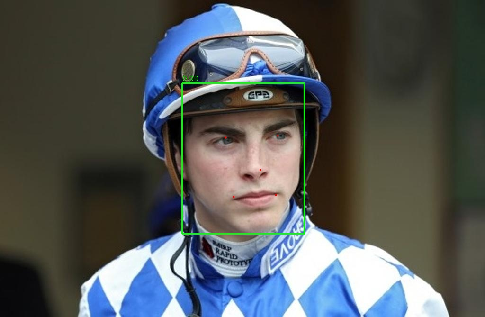

# RetinaFace

This example runs RetinaFace face detection with AMLNN. The full flow is:

1. Prepare or download an ONNX model.
2. Convert the ONNX model to an ADLA model.
3. Run the Python or C++ demo with the ADLA model.
4. Check detection images and profiling reports.

## Directory Layout

```text
examples/retinaface/
|-- cpp/                  # C++ demo and build scripts
|-- input/                # Input images for demo
|-- model/                # Put ONNX and ADLA models here
|-- py/                   # Python conversion and demo scripts
|-- result.jpg            # Example detection output
`-- Visualization.png     # Example profiling visualization
```

## License

This example code is licensed under the Apache License 2.0. See the repository root [LICENSE](../../LICENSE) file for details.

The RetinaFace model is provided by a third party. Check and follow the license and usage terms from the model source before redistribution or commercial use.

The model pre-processing and post-processing code in this example was generated by AI. If any part is similar to existing work and causes concern, please contact us and we will remove or adjust it.

## 1. Prepare The ONNX Model

Model source:

https://www.modelscope.cn/models/iic/cv_resnet50_face-detection_retinaface/files

You can either export the ONNX model from the ModelScope PyTorch model or download the prepared ONNX model.

### Option A: Export ONNX

Install or clone the ModelScope model package:

```bash
git clone https://www.modelscope.cn/iic/cv_resnet50_face-detection_retinaface.git
```

Place `pytorch_model.pt` and `configuration.json` where `py/convert_to_onnx.py` can load it. It is recommended to place both files under `examples/retinaface/py/
`. Then run:

```bash
cd examples/retinaface/py
python convert_to_onnx.py
```

The script writes `retinaface_resnet50.onnx` by default.

### Option B: Download ONNX

Download the prepared ONNX model and put it under `examples/retinaface/model/`:

```text
https://pub-8378326bd0fe4b1d9312a3847f6316a2.r2.dev/model_zoo/retinaface/retinaface_resnet50.onnx
```

Expected path:

```text
examples/retinaface/model/retinaface_resnet50.onnx
```

## 2. Convert ONNX To ADLA

Run the ADLA export script from `examples/retinaface/py`:

```bash
cd examples/retinaface/py
python export_adla.py \
  --onnx ../model/retinaface_resnet50.onnx \
  --dataset-path ../../../resource/COCO_subset.txt \
  --target-platform 005 \
  --adla ../model/RetinaFace_int8_A311D2.adla
```

Arguments:

| Argument | Description |
| --- | --- |
| `--onnx` | Path to the RetinaFace ONNX model. |
| `--dataset-path` | Quantization dataset path. |
| `--target-platform` | Platform ID. A311D2: 003. S905X5: 005. C302X2: 006. A311Y3: 007. |
| `--adla` | Optional output ADLA path. |

After conversion, the expected model path is:

```text
examples/retinaface/model/RetinaFace_int8_A311D2.adla
```

## 3. Run Python Demo

### Prerequisites

- Python 3.10
- `numpy`
- `opencv-python`
- AMLNN Python wheel for the target device

Install dependencies on the target device:

```bash
pip install numpy opencv-python amlnn-1.0.0-cp310-cp310-linux_aarch64.whl
```

Run image inference:

```bash
cd examples/retinaface/py
python RetinaFace.py \
  --model-path ../model/RetinaFace_int8_A311D2.adla \
  --image-dir ../input
```

Run camera inference:

```bash
cd examples/retinaface/py
python RetinaFace_camera.py \
  --model-path ../model/RetinaFace_int8_A311D2.adla
```

Python demo arguments:

| Argument | Description |
| --- | --- |
| `--model-path` | Path to the ADLA model. |
| `--image-dir` | Directory containing test images. Used by `RetinaFace.py`. |

The image demo processes `.jpg`, `.jpeg`, `.png`, and `.bmp` files, then saves results to `{model_name}_result`.

## 4. Run C++ Demo

### Build For Android

Prerequisites:

- Android NDK, r25e recommended
- `ANDROID_NDK_PATH`, `ANDROID_NDK`, or `ANDROID_NDK_HOME` set
- `AMLNN_HOME` pointing to the AMLNN toolkit

Build:

```bash
cd examples/retinaface/cpp
AMLNN_HOME=/path/to/amlnn-toolkit ./build-android.sh -a arm64-v8a
```

The executable is generated at:

```text
examples/retinaface/cpp/build/android/retinaface_demo
```

### Run On Device

Push files:

```bash
adb push build/android/retinaface_demo /data/local/tmp/
adb push ../model/RetinaFace_int8_A311D2.adla /data/local/tmp/
adb push ../input /data/local/tmp/retinaface_input
```

Run:

```bash
adb shell
cd /data/local/tmp
chmod +x retinaface_demo
export LD_LIBRARY_PATH=/vendor/lib64
./retinaface_demo RetinaFace_int8_A311D2.adla ./retinaface_input
```

Usage:

```text
./retinaface_demo <model.adla> <image_dir>
```

## 5. Results

### Detection Output

The demos print the detection count. Output images include face bounding boxes and five landmarks for eyes, nose, and mouth corners.

Pull the Python result folder from the device:

```bash
adb pull /data/local/tmp/RetinaFace_int8_A311D2_result
```

Example result:




