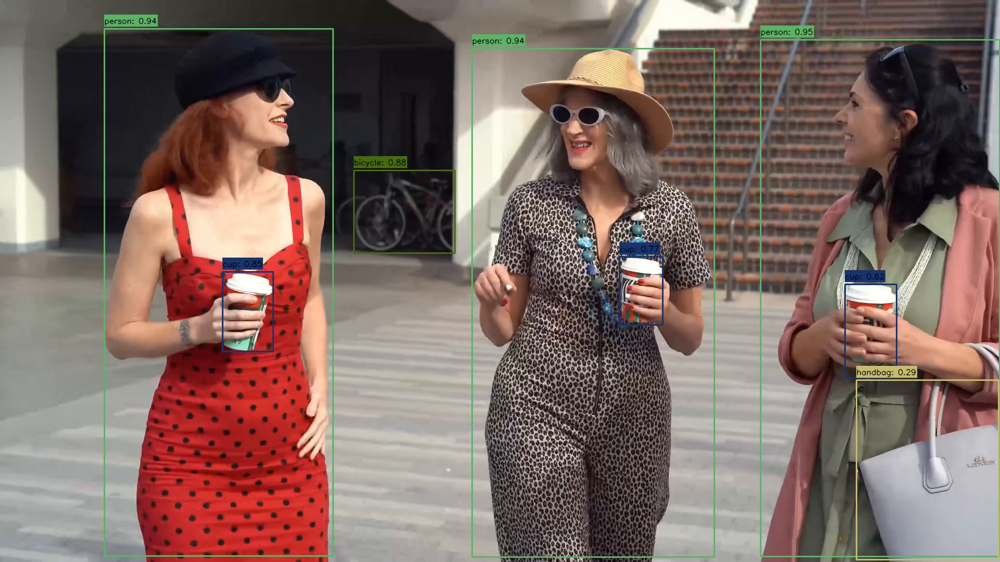

# yolov8

## 1.Overview

​		YOLOv8 was released by Ultralytics on January 10, 2023, offering cutting-edge performance in terms of accuracy and speed. Building upon the advancements of previous YOLO versions, YOLOv8 introduced new features and optimizations that make it an ideal choice for various [object detection](https://www.ultralytics.com/blog/a-guide-to-deep-dive-into-object-detection-in-2025) tasks in a wide range of applications. 

## 2.Model Download

- **Open Source model**

  - **Open Source projects:** https://github.com/ultralytics/ultralytics/tree/v8.2.0

  - **Export Model Step:**	

    - **Install ultralytics**

        pip install torch==2.4.1

        pip install torchvision==0.19.1

        pip install ultralytics==8.2.0

    - **Download weights**

      wget https://github.com/ultralytics/assets/releases/download/v8.2.0/yolov8m.pt

      wget https://github.com/ultralytics/assets/releases/download/v8.2.0/yolov8s.pt

      wget https://github.com/ultralytics/assets/releases/download/v8.2.0/yolov8n.pt

    - **Export Model**

      ```
      from ultralytics import YOLO
      
      model = YOLO("yolov8m.pt")
      model.export(format="onnx", opset=12, simplify=True, dynamic=False, imgsz=640)
      ```


- **Exported Model**

  ​	link to amlogic server( **onnx model   or quantized tflite**)

  

## 3. Model Conversion

```
cd model
Usage:   ./adla_covnert.sh model_path adla_tookkit_path target_platform

example
 ./adla_covnert.sh yolov8m.onnx  /xxxx/adla-toolkit-binary-3.2.9.3 PRODUCT_PID0XA005
 ./adla_covnert.sh yolov8s.onnx  /xxxx/adla-toolkit-binary-3.2.9.3 PRODUCT_PID0XA005
 ./adla_covnert.sh yolov8n.onnx  /xxxx/adla-toolkit-binary-3.2.9.3 PRODUCT_PID0XA005
```

| Parameter         | Discription                                                  |
| ----------------- | ------------------------------------------------------------ |
| model_path        | onnx model path                                              |
| adla_tookkit_path | path to adla_toolkit                                         |
| target_platform   | Specify target platform. for A311D2 : PRODUCT_PID0XA003。for S905X5:  PRODUCT_PID0XA005 |


## 4. Demo Run

### CPP

#### 1. Compile

**Prerequisites:**
- Android NDK (r25e recommended)
- `ANDROID_NDK_PATH` environment variable set

**Build:**
```bash
# Build for arm64-v8a
cd examples/yolov8/cpp
./build-android.sh -a arm64-v8a
```

The executable will be generated at `build/android/yolov8_demo` (Note: executable name may vary, verify in build folder).

#### 2. Run

```bash
# Push executable to device
adb push build/android/yolov8_demo /data/local/tmp/
adb push model/yolov8s_int8_A311D2.adla /data/local/tmp/
adb push test_image.jpg /data/local/tmp/

# Run on device
adb shell
cd /data/local/tmp
chmod +x yolov8_demo
export LD_LIBRARY_PATH=/vendor/lib64 or (/vendor/lib)

# Usage: ./yolo_world_demo <model_path> <image_path>
./yolov8_demo yolov8s_int8_A311D2.adla test_image.jpg"
```

**Note:** Replace `yolov8s_int8_A311D2.adla` with your actual model file path.

### Python

**Prerequisites:**
- Python 3.10
- Required packages: `numpy`, `opencv-python`, `amlnnlite`

**Install dependencies:**
```bash
pip install numpy opencv-python amlnnlite-1.0.0-cp310-cp310-linux_aarch64.whl
```

**Run on device:**
```bash
python yolov8.py --model-path ./yolov8s_int8_A311D2.adla
```

The script will automatically process all image files (`.jpg`, `.jpeg`, `.png`, `.bmp`) in the current directory and save results to a `{model_name}_result` folder.

## 5.Results
The program will print the detection count and inference time. The result image with bounding boxes will be saved to the specified output path (`result.jpg` by default).


You can pull the result image back to view it:
```bash
adb pull result.jpg.
```


