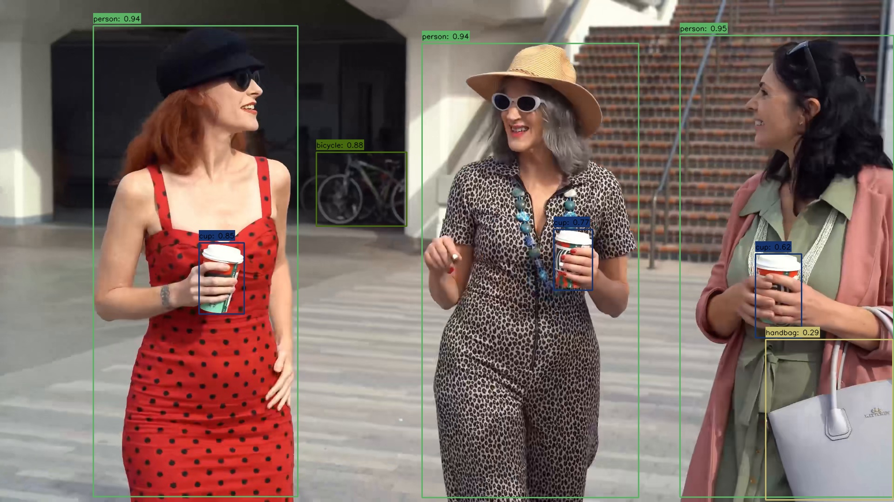

# Yolov8

This example runs YOLOV8 with AMLNN. The full flow is:

1. Convert the ONNX model to an ADLA model.
2. Supported Input Formats.
3. Run the Python demo with the ADLA model.
4. Run the C++ (Linux/Android) demo with the ADLA model.
5. Check detection images/results.

## Directory Layout

```bash
examples/yolov8/
├── cpp/               # C++ demo and build scripts
├── input/             # Input images for demo
├── model/             # Put ONNX and ADLA models here
├── py/                # Python conversion and demo scripts
└── result.jpg         # Example detection output
```

## License

This example code is license under the Apache License 2.0. See the repository root [LICENSE](../../LICENSE) file for details.

The Yolov8 model is provided by a third party, Check and follow the license and usage terms from the model source before redistribution or commercial use.

The model pre-processing and post-processing code in this example was partially generated by AI. If any part is similar to existing work and causes concern, please contact us and we will remove or adjust it promptly.

## 1. Model Conversion

Run the ADLA export script from `examples/yolov8/py`:

```bash
cd examples/yolov8/py
python export_adla.py \
  --onnx ../model/model.onnx \
  --dataset-path ../../../resource/detection_dataset.txt \
  --target-platform 007 \
  --output-dir ../model
```

| Parameter           | Description                                                                                                                              |
| ------------------- | ---------------------------------------------------------------------------------------------------------------------------------------- |
| `--onnx`            | Path to the input `.onnx` model.                                                                                                         |
| `--dataset-path`    | (Optional) Path to a `.txt` file containing the input paths used for quantization calibration. Required for `w8a8` and `w8a16 (i16)`.[1] |
| `--target-platform` | Target platform ID. See the full list of supported platforms [**HERE**](../../docs/mapping.md).                                          |
| `--output-dir`      | (Optional) Directory where the generated `.adla` model will be saved. Defaults to `../model`.                                            |

> **[1] Quantization dataset note**
>
> A calibration dataset is **not required** when using `activation_dtype="f16"`, such as `w8a16 (f16)` or `w16a16 (f16)`. Set this explicitly in the `amlnn.config()` call.
>
> If no dataset is provided, AMLNN generates random calibration data instead of failing, which can severely degrade model accuracy.
>
> `activation_dtype` does not apply to `w8a8`.

After conversion, the generated filename from AMLNN is preserved. For the example `model.onnx` with the current `w8a8` configuration, the expected model path is:

```text
examples/yolov8/model/model_w8a8.adla
```

## 2. Supported Input Formats

The YOLOv8 inference demo supports standard image files as well as raw image and direct model-input tensor formats.

| Format                          | Description                                                                                                                |
| ------------------------------- | -------------------------------------------------------------------------------------------------------------------------- |
| `.jpg`, `.jpeg`, `.png`, `.bmp` | Standard image files loaded with OpenCV and processed through the normal YOLOv8 preprocessing pipeline.                    |
| `.txt`                          | Raw BGR `uint8` image pixel values stored as text. *The file must NOT contain shape header or metadata.*                          |
| `.bin`                          | Final preprocessed model input tensor stored in raw binary form. Passed directly to AMLNN inference without preprocessing. |
| `.qtxt`                         | Final preprocessed model input tensor stored as text. Passed directly to AMLNN inference without preprocessing.            |

#### Standard Image Inputs

Standard image files follow the normal YOLOv8 preprocessing flow:

```text
.jpg/.jpeg/.png/.bmp
    -> image loading
    -> letterbox resize
    -> BGR to RGB
    -> normalize
    -> quantize if required
    -> inference
```

### Raw `.txt` Image Input

A `.txt` file represents raw BGR `uint8` image pixel values ranging from `0` to `255`.

The file contains **only pixel values** and does not include a shape header or other metadata. The image shape is assumed to match the model input dimensions in `H x W x 3` format.

Before processing, the demo checks the total number of values in the `.txt` file against the expected number of input image elements:

```text
H x W x 3
```

The input flow is:

```text
.txt
    -> read raw BGR uint8 pixel values
    -> verify element count matches H x W x 3
    -> reshape to H x W x 3
    -> BGR to RGB
    -> normalize
    -> quantize if required
    -> inference
```

> **Note:** The `.txt` file must already contain the expected number of pixels for the model input resolution. It should not include a shape header. If the number of values does not match the expected `H x W x 3` size, the input is skipped.


#### Direct `.bin` and `.qtxt` Model Inputs

The `.bin` and `.qtxt` formats contain the **final model input tensor after preprocessing and quantization**.

They do not contain dimensions, shape headers, or other metadata.

* `.bin` stores the tensor in raw binary form.
* `.qtxt` stores the same tensor values as text.

The tensor is read using the input tensor shape and data type reported by AMLNN and is passed directly to `amlnn.inference()`.

These formats support the AMLNN input tensor types handled by the inference script, including `float32`, `int8`, `uint8`, and `int16` where applicable.

Because `.bin` and `.qtxt` contain only the final model tensor, the dimensions and letterbox parameters of the original source image are not available. The inference script therefore treats the tensor as a model-resolution image with:

```text
scale = 1.0
pad = (0, 0)
```

For these direct tensor inputs, detection coordinates are displayed in **model-input coordinates** rather than being mapped back to the dimensions of the original source image.

### Generate Test Inputs

A separate input-generation utility, `generate_inputs.py`, can be used to create `.txt`, `.bin`, and `.qtxt` test inputs from normal image files.

The utility accepts standard image formats such as `.jpg`, `.jpeg`, `.png`, and `.bmp`. It does not use `.txt`, `.bin`, or `.qtxt` files as source inputs.

The ADLA model is loaded only to obtain the input tensor dimensions, scale, zero point, and tensor type. The utility does not perform inference.

For each source image, three files are generated:

* `.txt`: Contains the original unprocessed BGR image data. The `.txt` file can only be used by the inference demo if the source image dimensions already match the model input dimensions.
* `.bin`: Contains the final preprocessed and quantized model input tensor in raw binary form. It can be passed directly to the model without additional preprocessing or quantization.
* `.qtxt`: Contains the same final model input tensor as `.bin`, but stores the tensor values as text. It also bypasses preprocessing and quantization during inference.

The generation flow is:

```text
input image
    |
    +-> original BGR image
    |       -> .txt
    |
    +-> YOLOv8 preprocessing
            -> letterbox
            -> BGR to RGB
            -> normalization
            -> quantization if required
                    |
                    +-> .bin
                    |
                    +-> .qtxt
```

Run the utility from `examples/yolov8/py`:

```bash
cd examples/yolov8/py

python generate_inputs.py \
    --adla ../model/model_w8a8.adla \
    --image-dir ../input \
    --output-dir generated_inputs
```

Argument Descriptions:

| Argument       | Description                                                                                                               |
| -------------- | ------------------------------------------------------------------------------------------------------------------------- |
| `--adla` | Path to the compiled YOLOv8 model in `.adla` format. The model is loaded only to obtain its input tensor information.     |
| `--image-dir`  | Directory containing source `.jpg`, `.jpeg`, `.png`, or `.bmp` images to convert.                                         |
| `--output-dir` | (Optional) Directory where the generated `.txt`, `.bin`, and `.qtxt` files will be saved. Defaults to `generated_inputs`. |

For each processed image, the utility generates all three formats:

```text
generated_inputs/
├── test_image.txt
├── test_image.bin
└── test_image.qtxt
```

The `.bin` and `.qtxt` files contain the final model input tensor. They contain no image-shape or letterbox metadata and are supplied directly to AMLNN inference, bypassing image loading, resizing, letterboxing, color conversion, normalization, and quantization.

## 3. Run Python Demo

### Prerequisites

* Python 3.10
* Required packages: `amlnn`

### Install Dependencies

```bash
pip install amlnn_edge_toolkit_lite-1.0.0-cp310-cp310-linux_aarch64.whl
```

### Run on Device

```bash
python yolov8_inference.py \
    --adla ../model/model_w8a8.adla \
    --image-dir ../input \
    --conf 0.25 \
    --nms 0.4
```

Argument Descriptions:

| Argument       | Description                                                                          |
| -------------- | ------------------------------------------------------------------------------------ |
| `--adla`       | Path to the compiled model in `.adla` format.                                        |
| `--image-dir`  | Directory containing test images.                                                    |
| `--conf`       | (Optional) Confidence score threshold used to filter detections. Defaults to `0.25`. |
| `--nms`        | (Optional) IoU threshold used during Non-Maximum Suppression. Defaults to `0.4`.     |

The script will automatically process all supported input files (`.jpg`, `.jpeg`, `.png`, `.bmp`, `.bin`, `.txt`, `.qtxt`) in the specified image directory and save results to a `{model_name}_result` folder.

## 4. Run C++ Demo

### Build For Android

#### Prerequisites

* **Android NDK** (r27d recommended) installed on your system.
* **AMLNN Toolkit** downloaded and extracted.
* Prebuilt OpenCV for Android located in the `dependency/opencv/` folder.

#### 1. Setup Environment

Export the paths to your NDK (the toolchain) and AMLNN (the neural network dependency) so the script can find them.

```bash
export ANDROID_NDK_PATH=/path/to/android-ndk-r27d
export AMLNN_HOME=/path/to/amlnn-toolkit/amlnn_runtime
```

#### 2. Build

Navigate to the C++ directory and run the build script.

```bash
cd examples/yolov8/cpp

# Build for 64-bit (arm64-v8a) - Default
./build-android.sh

# Build for 32-bit (armeabi-v7a)
./build-android.sh -a armeabi-v7a
```

The executable will be generated in the build folder corresponding to the selected Android ABI:

* 64-bit: `build/android/arm64-v8a/yolov8_demo`
* 32-bit: `build/android/armeabi-v7a/yolov8_demo`

#### 3. Example Run

The following example uses the default 64-bit (`arm64-v8a`) build.

```bash
# Push executable and assets to device
adb shell "mkdir -p /data/local/tmp/"
adb push build/android/arm64-v8a/yolov8_demo /data/local/tmp/
adb push ../model/model_w8a8.adla /data/local/tmp/
adb push ../input/ /data/local/tmp/

# Run on device
adb shell
cd /data/local/tmp
chmod +x yolov8_demo
export LD_LIBRARY_PATH=/vendor/lib64

# Usage: ./yolov8_demo <model_path> <image_dir>
./yolov8_demo model_w8a8.adla input/
```

> **Note:** For a 32-bit (`armeabi-v7a`) build, use `build/android/armeabi-v7a/yolov8_demo` and the corresponding 32-bit library path. Replace `model_w8a8.adla` with your actual model file name.

---

### Build For Linux

The Linux build process supports two distinct modes:

1. **Standard Linux cross-compilation** (default)
2. **Yocto SDK compilation**

#### Mode 1: Standard Linux Cross-Compile (Default)

##### Prerequisites

* A GCC Cross-Compiler toolchain (GCC 10.3 recommended).
* The toolchain's `bin/` folder must be added to your system's `PATH`.
* Prebuilt OpenCV located in the `dependency/opencv/` folder.
* `AMLNN_HOME` environment variable set.

##### 1. Setup Environment

Add your downloaded toolchain to your `PATH` and export the `AMLNN_HOME` variable so the script can find the compiler and neural network dependencies.

```bash
# Export the AMLNN path
export AMLNN_HOME=/path/to/amlnn-toolkit/amlnn_runtime

# For 64-bit (aarch64) builds, add the 64-bit toolchain to PATH:
export PATH=/path/to/gcc-arm-10.3-2021.07-x86_64-aarch64-none-linux-gnu/bin:$PATH

# OR for 32-bit (arm) builds, add the 32-bit toolchain to PATH:
export PATH=/path/to/gcc-arm-10.3-2021.07-x86_64-arm-none-linux-gnueabihf/bin:$PATH
```

##### 2. Build

```bash
cd examples/yolov8/cpp

# Build for 64-bit (Default)
./build-linux.sh

# Build for 32-bit
./build-linux.sh -b 32
```

> **Optional Override:** If your compiler has a different prefix name (for example, `aarch64-linux-gnu` instead of `aarch64-none-linux-gnu`), you can override the default by setting the `GCC_COMPILER` variable:

```bash
GCC_COMPILER=aarch64-linux-gnu ./build-linux.sh
```

The executable will be generated in the build folder corresponding to the selected architecture:

* 64-bit: `build/linux/64/yolov8_demo`
* 32-bit: `build/linux/32/yolov8_demo`

#### Mode 2: Yocto/Debian/Armbian Build

##### 1. Prerequisites

* Yocto SDK installed.
* CMake Toolchain file available.
* Prebuilt OpenCV located at `../../../dependency/opencv/` (relative to the script directory).

##### 2. Setup Environment

```bash
# Export the AMLNN path
export AMLNN_HOME=/path/to/amlnn-toolkit/amlnn_runtime
```

##### 3. Build

```bash
cd examples/yolov8/cpp

# Build for Yocto 64-bit (Default)
./build-linux.sh -m yocto -s /path/to/yocto_sdk_root -t /path/to/toolchain.cmake

# Build for Yocto 32-bit
./build-linux.sh -m yocto -b 32 -s /path/to/yocto_sdk_root -t /path/to/toolchain.cmake
```

> **Note:** You can also use the `YOCTO_SDK_ROOT` and `TOOLCHAIN_FILE` environment variables instead of passing the `-s` and `-t` flags.

The executable will be generated in the build folder corresponding to the selected architecture:

* 64-bit: `build/yocto/64/yolov8_demo`
* 32-bit: `build/yocto/32/yolov8_demo`

#### 3. Example Run

The following example uses the default 64-bit Linux build.

```bash
# Push executable and assets to device (adjust build path if using Yocto)
adb shell "mkdir -p /data/local/tmp/"
adb push build/linux/64/yolov8_demo /data/local/tmp/
adb push ../model/model_w8a8.adla /data/local/tmp/
adb push ../input/ /data/local/tmp/

# Run on device
adb shell
cd /data/local/tmp
chmod +x yolov8_demo

# Usage: ./yolov8_demo <model_path> <image_dir>
./yolov8_demo model_w8a8.adla input/
```

> **Note:** Replace `model_w8a8.adla` with your actual model file name. Adjust the executable path if using a 32-bit or Yocto build.

## 5. Results

### Performance Feedback

By setting the log level to `INFO`, the program provides runtime performance information after inference. The console output may include:

* **Hardware Information:** System and ADLA library versions.
* **Model Overview:** Input and output tensor configurations.
* **NPU Metrics:** Inference latency and DRAM bandwidth usage.

### Detection Output

For each input image, the demo performs object detection and saves a visualization containing the detected bounding boxes.

The result images are saved inside the model result directory using the input image name. For example:

```text
<model_name>_result/
└── test_image_result.jpg
```

You can pull a result image back from the device for inspection:

```bash
adb pull <model_name>_result/test_image_result.jpg
```


