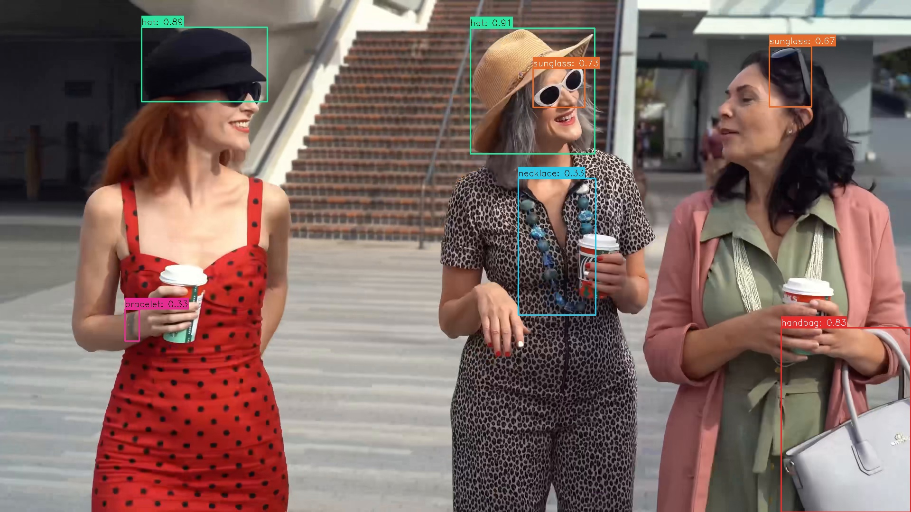

## Demo Run

### CPP

#### 1. Compile

**Prerequisites:**
- Android NDK (r25e recommended)
- `ANDROID_NDK_PATH` environment variable set

**Build:**
```bash
# Build for arm64-v8a
cd examples/yoloworld/cpp
./build-android.sh -a arm64-v8a
```

The executable will be generated at `build/android/yolo_world_demo` (Note: executable name may vary, verify in build folder).

#### 2. Run

```bash
# Push executable to device
adb push build/android/yolo_world_demo /data/local/tmp/
adb push model/yoloworld_int8_A311D2.adla /data/local/tmp/
adb push test_image.jpg /data/local/tmp/

# Run on device
adb shell
cd /data/local/tmp
chmod +x yolo_world_demo
export LD_LIBRARY_PATH=/vendor/lib64 or (/vendor/lib)

# Usage: ./yolo_world_demo <model_path> <image_path>
./yolo_world_demo yoloworld_int8_A311D2.adla test_image.jpg
```

**Note:** Replace `yoloworld_int8_A311D2.adla` with your actual model file path.

### Python

**Prerequisites:**
- Python 3.10
- Required packages: `numpy`, `opencv-python`, `amlnnlite`

**Install dependencies:**
```bash
pip install numpy opencv-python amlnnlite-1.0.0-cp310-cp310-linux_aarch64.whl
```

**Run on device:**
```bash
# Basic usage (process current directory)
python yoloworld.py --model-path ./yoloworld_int8_A311D2.adla

# Specify image directory
python yoloworld.py --model-path ./yoloworld_int8_A311D2.adla --image-dir ./
```

The script will automatically process all image files (`.jpg`, `.jpeg`, `.png`, `.bmp`) in the specified directory and save results to a `{model_name}_result` folder.

## Results

The program will print the detection count and detected objects for each processed image. The result image with bounding boxes will be saved to the specified output directory.

You can pull the result image back to view it:
```bash
adb pull result.jpg.
```


The program detects objects from predefined classes (handbag, backpack, wallet, watch, necklace, bracelet, earrings, finger ring, sunglass, hat, shoes, belt, makeup palette, lipstick tube, car, truck, bicycle, motorcycle, phone, laptop, camera, wine bottle, stuffed toy) and draws bounding boxes with class labels on the result images.
